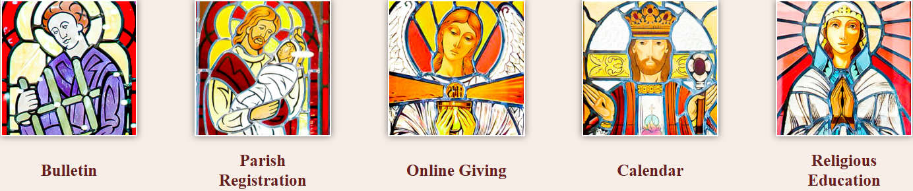

# blockcontent / ql-boxtitle

**Site:** StLaw-Alex (`https://stlaw-alex.backup.solutiosoftware.com`)
**Page:** `/`
**Captured:** 2026-06-17 16:48 UTC

## Selectors

- `.ql-boxtitle`
- `.ql-boxtitle .g-blockcontent`
- `.ql-boxtitle .g-blockcontent-subcontent-block`

## Description

Box-style quicklinks with a title inside each box.

## Screenshot

## Applied Styles

See [styles.json](styles.json) for the full rule dump.

## Notes

stlaw-alex.
