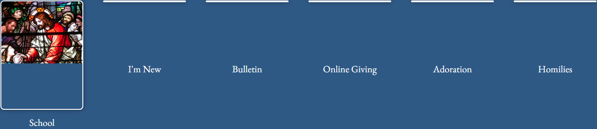

# blockcontent / ql-portraitbox

**Site:** Shelbyville (`https://shelbyville.backup.solutiosoftware.com`)
**Page:** `/home-cl`
**Captured:** 2026-06-17 16:40 UTC

## Selectors

- `.ql-portraitbox`
- `.ql-portraitbox .g-blockcontent`
- `.ql-portraitbox .g-blockcontent-subcontent-block`

## Description

Portrait-style quicklink boxes with image and title.

## Screenshot

## Applied Styles

See [styles.json](styles.json) for the full rule dump.

## Notes

shelbyville.
