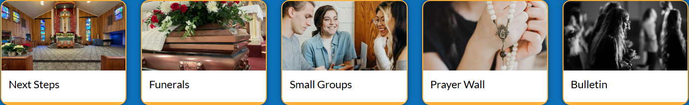

# blockcontent / ql-sbound

**Site:** Assumption-Center (`https://assumption-center.backup.solutiosoftware.com`)
**Page:** `/`
**Captured:** 2026-06-17 16:55 UTC

## Selectors

- `.ql-sbound`
- `.ql-sbound .g-blockcontent`
- `.ql-sbound .g-blockcontent-subcontent-block`

## Description

Sidebar-bound quicklinks with label and icon.

## Screenshot

## Applied Styles

See [styles.json](styles.json) for the full rule dump.

## Notes

assumption-center.
