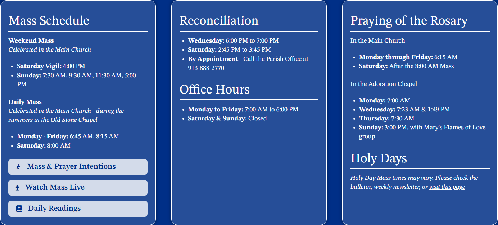

# contentarray / mass-container

**Site:** Trinity-Lenexa (`https://trinity-lenexa.backup.solutiosoftware.com`)
**Page:** `/`
**Captured:** 2026-06-17 16:50 UTC

## Selectors

- `.mass-container`
- `.mass-container .g-content-array`
- `.mass-container .g-array-item-text`

## Description

Mass schedule in a full-width container.

## Screenshot

## Applied Styles

See [styles.json](styles.json) for the full rule dump.

## Notes

stpeter-eaton, trinity-lenexa.
