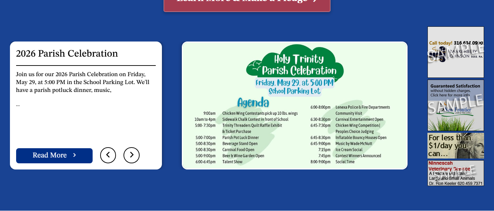

# Section Layout Inventory — Trinity-Lenexa

**URL:** https://trinity-lenexa.backup.solutiosoftware.com  
**Scanned:** 2026-06-17 17:40 UTC  
**Sections:** 13

---

## Layout: `100`

### `g-slideshow`

**Fingerprint:** `100`  
**Section classes:** _(none)_  
**Pages:**   


**Grid 1** `100`
  - size-100 `.fullwidth-swiper` `.rotate-sw` → `swiper`

**Section styles:** background: rgba(0, 47, 135, 0.9)

**Container max-width:** 1440px

<details><summary>Section CSS rules</summary>

```css
* { box-sizing: inherit }
section { display: block }
img { height: auto; max-width: 100%; display: inline-block; vertical-align: middle; border-top-width: 0px; border-right-width: 0px; border-bottom-width: 0px; border-left-width: 0px; border-top-style: none; border-right-style: none; border-bottom-style: none; border-left-style: none; border-top-color: currentcolor; border-right-color: currentcolor; border-bottom-color: currentcolor; border-left-color: currentcolor; border-image-source: initial; border-image-slice: initial; border-image-width: initial; border-image-outset: initial; border-image-repeat: initial }
.g-container { margin-top: 0px; margin-right: auto; margin-bottom: 0px; margin-left: auto; padding-top: 0px; padding-right: 0px; padding-bottom: 0px; padding-left: 0px }
.g-block .g-container { width: auto }
.g-grid { display: flex; flex-direction: row; flex-wrap: wrap; list-style-position: initial; list-style-image: initial; list-style-type: none; margin-top: 0px; margin-right: 0px; margin-bottom: 0px; margin-left: 0px; padding-top: 0px; padding-right: 0px; padding-bottom: 0px; padding-left: 0px; text-rendering: optimizespeed }
.g-block { flex-grow: 1; flex-shrink: 1; flex-basis: 0%; min-width: 0px; min-height: 0px }
.size-100 { width: 100%; max-width: 100%; flex-grow: 0; flex-basis: 100% }
.g-flushed { padding-top: 0px; padding-right: 0px; padding-bottom: 0px; padding-left: 0px }
.g-flushed .g-content { padding-top: 0px; padding-right: 0px; padding-bottom: 0px; padding-left: 0px; margin-top: 0px; margin-right: 0px; margin-bottom: 0px; margin-left: 0px }
.g-flushed .g-container { width: 100% }
.g-content { margin-top: 0.625rem; margin-right: 0.625rem; margin-bottom: 0.625rem; margin-left: 0.625rem; padding-top: 1.5rem; padding-right: 1.5rem; padding-bottom: 1.5rem; padding-left: 1.5rem }
.g-flushed > .g-container { margin-top: 0px; margin-right: 0px; margin-bottom: 0px; margin-left: 0px; padding-top: 0px; padding-right: 0px; padding-bottom: 0px; padding-left: 0px }
#g-slideshow { color: rgb(0, 0, 0); background-color: rgb(255, 255, 255) }
.g-swiper.swiper-container-horizontal > .swiper-pagination-bullets { display: flex; bottom: 0px; left: 50%; transform: translateX(-50%); width: auto }
.g-swiper div[class*="swiper-pagination-parent"] { position: absolute; text-align: center; transition-behavior: normal; transition-duration: 0.3s; transition-timing-function: ease; transition-delay: 0s; transition-property: opacity; z-index: 10 }
.g-swiper.swiper-container-horizontal > .swiper-pagination-bullets .swiper-pagination-bullet { margin-top: 2rem; margin-right: 1rem; margin-bottom: 2rem; margin-left: 1rem; background-image: initial; background-position-x: initial; background-position-y: initial; background-size: initial; background-repeat: initial; background-attachment: initial; background-origin: initial; background-clip: initial; background-color: transparent; border-top-width: 2px; border-right-width: 2px; border-bottom-width: 2px; border-left-width: 2px; border-top-style: solid; border-right-style: solid; border-bottom-style: solid; border-left-style: solid; border-top-color: rgb(255, 255, 255); border-right-color: rgb(255, 255, 255); border-bottom-color: rgb(255, 255, 255); border-left-color: rgb(255, 255, 255); border-image-source: initial; border-image-slice: initial; border-image-width: initial; border-image-outset: initial; border-image-repeat: initial; opacity: 1; height: 22px; width: 22px; position: relative; display: flex; justify-content: center; align-items: center; outline-color: initial; outline-style: initial; outline-width: 0px }
.g-swiper.swiper-container-horizontal > .swiper-pagination-bullets .swiper-pagination-bullet-active { background-image: initial; background-position-x: initial; background-position-y: initial; background-size: initial; background-repeat: initial; background-attachment: initial; background-origin: initial; background-clip: initial; background-color: rgb(255, 255, 255); opacity: 1; border-top-color: rgb(255, 255, 255); border-right-color: rgb(255, 255, 255); border-bottom-color: rgb(255, 255, 255); border-left-color: rgb(255, 255, 255) }
.g-swiper .g-swiper-slider .swiper-slide { position: relative }
.g-swiper .g-swiper-slider .swiper-slide .slide { position: absolute; margin-top: 0px; margin-right: auto; margin-bottom: 0px; margin-left: auto; top: 0px; bottom: 0px; left: 0px; right: 0px; transform-style: preserve-3d; z-index: 20 }
.g-swiper .g-swiper-slider .swiper-slide .slide .slide-content-wrapper { display: flex; align-items: center; justify-content: center; height: 100% }
.g-swiper .g-swiper-slider .swiper-slide .slide .slide-content-wrapper .slide-content { text-align: center }
.g-swiper .g-swiper-slider .swiper-slide .slide .slide-content-wrapper .slide-content .g-swiper-text { font-size: 1.1vw; font-weight: 400; line-height: 1.3; margin-top: 1rem; margin-right: 4rem; margin-bottom: 1rem; margin-left: 4rem; max-width: 1200px; color: rgb(255, 255, 255) }
.swiper-navigation div[class*="button-next"] { position: absolute; font-size: 4rem; color: rgb(255, 255, 255); outline-color: initial; outline-style: none; outline-width: initial; z-index: 20; cursor: pointer }
.swiper-navigation div[class*="button-prev"] { left: 1rem; top: 50%; margin-top: 0px; margin-right: 0px; margin-bottom: 0px; margin-left: 0px; padding-top: 0px; padding-right: 0px; padding-bottom: 0px; padding-left: 0px; transform: translateY(-50%) }
.fa { font-family: var(--fa-style-family,"Font Awesome 6 Free"); font-weight: var(--fa-style,900) }
.swiper-container { margin-left: auto; margin-right: auto; position: relative; overflow-x: hidden; overflow-y: hidden; list-style-position: initial; list-style-image: initial; list-style-type: none; padding-top: 0px; padding-right: 0px; padding-bottom: 0px; padding-left: 0px; z-index: 1 }
.swiper-wrapper { position: relative; width: 100%; height: 100%; z-index: 1; display: flex; transition-property: transform; box-sizing: content-box }
.swiper-slide { flex-shrink: 0; width: 100%; height: 100%; position: relative; transition-property: transform }
.swiper-container-horizontal > .swiper-pagination-bullets { bottom: 10px; left: 0px; width: 100% }
.swiper-pagination-bullet { width: 8px; height: 8px; display: inline-block; border-top-left-radius: 100%; border-top-right-radius: 100%; border-bottom-right-radius: 100%; border-bottom-left-radius: 100%; background-image: initial; background-position-x: initial; background-position-y: initial; background-size: initial; background-repeat: initial; background-attachment: initial; background-origin: initial; background-clip: initial; background-color: rgb(0, 0, 0); opacity: 0.2 }
.swiper-pagination-clickable .swiper-pagination-bullet { cursor: pointer }
.swiper-pagination-bullet-active { opacity: 1; background-image: ; background-position-x: ; background-position-y: ; background-size: ; background-repeat: ; background-attachment: ; background-origin: ; background-clip: ; background-color:  }
.swiper-container-horizontal > .swiper-pagination-bullets .swiper-pagination-bullet { margin-top: 0px; margin-right: 4px; margin-bottom: 0px; margin-left: 4px }
.swiper-container .swiper-notification { position: absolute; left: 0px; top: 0px; pointer-events: none; opacity: 0; z-index: -1000 }
#swiper-9733 .slide { background-color: rgba(0, 0, 0, 0) }
```
</details>

### `g-above`

**Fingerprint:** `100`  
**Section classes:** _(none)_  
**Pages:**   


**Grid 1** `100`
  - size-100 `.ql-border-box` → `blockcontent`

**Section styles:** background: rgb(0, 47, 135)

**Container max-width:** 1440px

<details><summary>Section CSS rules</summary>

```css
* { box-sizing: inherit }
section { display: block }
a { background-image: initial; background-position-x: initial; background-position-y: initial; background-size: initial; background-repeat: initial; background-attachment: initial; background-origin: initial; background-clip: initial; background-color: transparent; text-decoration-line: none; text-decoration-thickness: initial; text-decoration-style: initial; text-decoration-color: initial }
img { height: auto; max-width: 100%; display: inline-block; vertical-align: middle; border-top-width: 0px; border-right-width: 0px; border-bottom-width: 0px; border-left-width: 0px; border-top-style: none; border-right-style: none; border-bottom-style: none; border-left-style: none; border-top-color: currentcolor; border-right-color: currentcolor; border-bottom-color: currentcolor; border-left-color: currentcolor; border-image-source: initial; border-image-slice: initial; border-image-width: initial; border-image-outset: initial; border-image-repeat: initial }
.g-container { margin-top: 0px; margin-right: auto; margin-bottom: 0px; margin-left: auto; padding-top: 0px; padding-right: 0px; padding-bottom: 0px; padding-left: 0px }
.g-grid { display: flex; flex-direction: row; flex-wrap: wrap; list-style-position: initial; list-style-image: initial; list-style-type: none; margin-top: 0px; margin-right: 0px; margin-bottom: 0px; margin-left: 0px; padding-top: 0px; padding-right: 0px; padding-bottom: 0px; padding-left: 0px; text-rendering: optimizespeed }
.g-block { flex-grow: 1; flex-shrink: 1; flex-basis: 0%; min-width: 0px; min-height: 0px }
.size-100 { width: 100%; max-width: 100%; flex-grow: 0; flex-basis: 100% }
h4 { margin-top: 0.75rem; margin-right: 0px; margin-bottom: 1.5rem; margin-left: 0px; text-rendering: optimizelegibility }
p { margin-top: 1.5rem; margin-right: 0px; margin-bottom: 1.5rem; margin-left: 0px }
.g-flushed { padding-top: 0px; padding-right: 0px; padding-bottom: 0px; padding-left: 0px }
.g-flushed .g-content { padding-top: 0px; padding-right: 0px; padding-bottom: 0px; padding-left: 0px; margin-top: 0px; margin-right: 0px; margin-bottom: 0px; margin-left: 0px }
.g-flushed .g-container { width: 100% }
.g-content { margin-top: 0.625rem; margin-right: 0.625rem; margin-bottom: 0.625rem; margin-left: 0.625rem; padding-top: 1.5rem; padding-right: 1.5rem; padding-bottom: 1.5rem; padding-left: 1.5rem }
.g-flushed > .g-container { margin-top: 0px; margin-right: 0px; margin-bottom: 0px; margin-left: 0px; padding-top: 0px; padding-right: 0px; padding-bottom: 0px; padding-left: 0px }
html body p { margin-top: 0px; margin-right: 0px; margin-bottom: 1.3rem; margin-left: 0px }
#g-above { color: rgb(0, 0, 0); background-image: initial; background-position-x: initial; background-position-y: initial; background-size: initial; background-repeat: initial; background-attachment: initial; background-origin: initial; background-clip: initial; background-color: rgb(255, 255, 255) }
#g-above .g-grid { align-items: center }
.g-blockcontent-subcontent-title-text { font-weight: 700; font-size: 1.5rem; margin-top: 0px; margin-bottom: 1rem; line-height: 1.3 }
.g-blockcontent-subcontent-title { margin-bottom: 0px }
.g-blockcontent-subcontent-block .g-blockcontent-buttons { text-align: left }
.g-blockcontent-buttons { margin-top: 0.5rem; margin-bottom: 1.5rem; text-align: center; text-decoration-line: underline; text-decoration-thickness: initial; text-decoration-style: initial; text-decoration-color: initial; font-size: 1.4vw }
```
</details>

### `g-feature`

**Fingerprint:** `100`  
**Section classes:** _(none)_  
**Pages:**   


**Grid 1** `100`
  - size-100 `.mass-container` → `contentarray`

**Section styles:** background: rgb(0, 47, 135)

**Container max-width:** 1440px

<details><summary>Section CSS rules</summary>

```css
* { box-sizing: inherit }
section { display: block }
a { background-image: initial; background-position-x: initial; background-position-y: initial; background-size: initial; background-repeat: initial; background-attachment: initial; background-origin: initial; background-clip: initial; background-color: transparent; text-decoration-line: none; text-decoration-thickness: initial; text-decoration-style: initial; text-decoration-color: initial }
strong { font-weight: bold }
.g-container { margin-top: 0px; margin-right: auto; margin-bottom: 0px; margin-left: auto; padding-top: 0px; padding-right: 0px; padding-bottom: 0px; padding-left: 0px }
.g-grid { display: flex; flex-direction: row; flex-wrap: wrap; list-style-position: initial; list-style-image: initial; list-style-type: none; margin-top: 0px; margin-right: 0px; margin-bottom: 0px; margin-left: 0px; padding-top: 0px; padding-right: 0px; padding-bottom: 0px; padding-left: 0px; text-rendering: optimizespeed }
.g-block { flex-grow: 1; flex-shrink: 1; flex-basis: 0%; min-width: 0px; min-height: 0px }
.size-100 { width: 100%; max-width: 100%; flex-grow: 0; flex-basis: 100% }
h2 { margin-top: 0.75rem; margin-right: 0px; margin-bottom: 1.5rem; margin-left: 0px; text-rendering: optimizelegibility }
p { margin-top: 1.5rem; margin-right: 0px; margin-bottom: 1.5rem; margin-left: 0px }
ul { margin-top: 1.5rem; margin-bottom: 1.5rem }
.g-flushed { padding-top: 0px; padding-right: 0px; padding-bottom: 0px; padding-left: 0px }
.g-flushed .g-content { padding-top: 0px; padding-right: 0px; padding-bottom: 0px; padding-left: 0px; margin-top: 0px; margin-right: 0px; margin-bottom: 0px; margin-left: 0px }
.g-flushed .g-container { width: 100% }
.g-content { margin-top: 0.625rem; margin-right: 0.625rem; margin-bottom: 0.625rem; margin-left: 0.625rem; padding-top: 1.5rem; padding-right: 1.5rem; padding-bottom: 1.5rem; padding-left: 1.5rem }
.g-flushed > .g-container { margin-top: 0px; margin-right: 0px; margin-bottom: 0px; margin-left: 0px; padding-top: 0px; padding-right: 0px; padding-bottom: 0px; padding-left: 0px }
html body p { margin-top: 0px; margin-right: 0px; margin-bottom: 1.3rem; margin-left: 0px }
.button { display: inline-block; font-family: poppins, Helvetica, Tahoma, Geneva, Arial, sans-serif; font-weight: 700; color: rgb(255, 255, 255); font-size: 1vw; background-image: initial; background-position-x: initial; background-position-y: initial; background-size: initial; background-repeat: initial; background-attachment: initial; background-origin: initial; background-clip: initial; background-color: rgb(255, 255, 255); text-align: center; margin-top: 0px; margin-right: 0px; margin-bottom: 0.5rem; margin-left: 0px; padding-top: 0.4rem; padding-right: 1.5rem; padding-left: 1.5rem; padding-bottom: 0.45rem; border-top-width: 2px; border-right-width: 2px; border-bottom-width: 2px; border-left-width: 2px; border-top-style: solid; border-right-style: solid; border-bottom-style: solid; border-left-style: solid; border-top-color: transparent; border-right-color: transparent; border-bottom-color: transparent; border-left-color: transparent; border-image-source: initial; border-image-slice: initial; border-image-width: initial; border-image-outset: initial; border-image-repeat: initial; border-top-left-radius: 0px; border-top-right-radius: 0px; border-bottom-right-radius: 0px; border-bottom-left-radius: 0px; vertical-align: middle; text-shadow: none; transition-behavior: normal; transition-duration: 0.2s; transition-timing-function: ease; transition-delay: 0s; transition-property: all }
#g-feature { color: rgb(0, 0, 0); background-image: initial; background-position-x: initial; background-position-y: initial; background-size: initial; background-repeat: initial; background-attachment: initial; background-origin: initial; background-clip: initial; background-color: rgb(255, 255, 255) }
.g-content-array { margin-left: -1.5rem; margin-right: -1.5rem }
.g-content-array .g-grid { margin-bottom: 2.5rem }
.g-content-array .g-grid:last-child { margin-bottom: 0px }
.g-content-array .g-content { margin-top: 0px; margin-right: 0px; margin-bottom: 0px; margin-left: 0px; padding-top: 0px }
.g-content-array .g-array-item .g-array-item-text { font-size: 1.25rem }
.g-content-array .g-array-item-text { margin-top: 15px; margin-right: 0px; margin-bottom: 0px; margin-left: 0px }
.g-array-item-text { margin-top: 0px; margin-right: 0px; margin-bottom: 0px; margin-left: 0px; padding-top: 0px; padding-right: 0px; padding-bottom: 0px; padding-left: 0px }
.link-line { text-decoration-line: underline; text-decoration-thickness: initial; text-decoration-style: initial; text-decoration-color: initial }
```
</details>

### `g-showcase`

**Fingerprint:** `100`  
**Section classes:** _(none)_  
**Pages:**   


**Grid 1** `100`
  - size-100 `.cc-container` → `contentarray`

**Section styles:** background: rgb(0, 47, 135)

**Container max-width:** 1440px

<details><summary>Section CSS rules</summary>

```css
* { box-sizing: inherit }
section { display: block }
a { background-image: initial; background-position-x: initial; background-position-y: initial; background-size: initial; background-repeat: initial; background-attachment: initial; background-origin: initial; background-clip: initial; background-color: transparent; text-decoration-line: none; text-decoration-thickness: initial; text-decoration-style: initial; text-decoration-color: initial }
button { color: inherit; font-style: inherit; font-variant-ligatures: inherit; font-variant-caps: inherit; font-variant-numeric: inherit; font-variant-east-asian: inherit; font-variant-alternates: inherit; font-variant-position: inherit; font-variant-emoji: inherit; font-weight: inherit; font-stretch: inherit; font-size: inherit; line-height: inherit; font-family: inherit; font-optical-sizing: inherit; font-size-adjust: inherit; font-kerning: inherit; font-feature-settings: inherit; font-variation-settings: inherit; font-language-override: inherit; margin-top: 0px; margin-right: 0px; margin-bottom: 0px; margin-left: 0px }
.g-container { margin-top: 0px; margin-right: auto; margin-bottom: 0px; margin-left: auto; padding-top: 0px; padding-right: 0px; padding-bottom: 0px; padding-left: 0px }
.g-grid { display: flex; flex-direction: row; flex-wrap: wrap; list-style-position: initial; list-style-image: initial; list-style-type: none; margin-top: 0px; margin-right: 0px; margin-bottom: 0px; margin-left: 0px; padding-top: 0px; padding-right: 0px; padding-bottom: 0px; padding-left: 0px; text-rendering: optimizespeed }
.g-block { flex-grow: 1; flex-shrink: 1; flex-basis: 0%; min-width: 0px; min-height: 0px }
.size-100 { width: 100%; max-width: 100%; flex-grow: 0; flex-basis: 100% }
h3 { margin-top: 0.75rem; margin-right: 0px; margin-bottom: 1.5rem; margin-left: 0px; text-rendering: optimizelegibility }
p { margin-top: 1.5rem; margin-right: 0px; margin-bottom: 1.5rem; margin-left: 0px }
ul { margin-top: 1.5rem; margin-bottom: 1.5rem }
.g-flushed { padding-top: 0px; padding-right: 0px; padding-bottom: 0px; padding-left: 0px }
.g-flushed .g-content { padding-top: 0px; padding-right: 0px; padding-bottom: 0px; padding-left: 0px; margin-top: 0px; margin-right: 0px; margin-bottom: 0px; margin-left: 0px }
.g-flushed .g-container { width: 100% }
.g-content { margin-top: 0.625rem; margin-right: 0.625rem; margin-bottom: 0.625rem; margin-left: 0.625rem; padding-top: 1.5rem; padding-right: 1.5rem; padding-bottom: 1.5rem; padding-left: 1.5rem }
h6 { font-size: 1rem }
.g-flushed > .g-container { margin-top: 0px; margin-right: 0px; margin-bottom: 0px; margin-left: 0px; padding-top: 0px; padding-right: 0px; padding-bottom: 0px; padding-left: 0px }
html body p { margin-top: 0px; margin-right: 0px; margin-bottom: 1.3rem; margin-left: 0px }
h3.g-title { font-size: 1rem; font-weight: 700; display: block; line-height: 1.5 }
.g-title { font-size: 0.8rem; font-weight: 700; line-height: 1.5; margin-bottom: 0px }
.button { display: inline-block; font-family: poppins, Helvetica, Tahoma, Geneva, Arial, sans-serif; font-weight: 700; color: rgb(255, 255, 255); font-size: 1vw; background-image: initial; background-position-x: initial; background-position-y: initial; background-size: initial; background-repeat: initial; background-attachment: initial; background-origin: initial; background-clip: initial; background-color: rgb(255, 255, 255); text-align: center; margin-top: 0px; margin-right: 0px; margin-bottom: 0.5rem; margin-left: 0px; padding-top: 0.4rem; padding-right: 1.5rem; padding-left: 1.5rem; padding-bottom: 0.45rem; border-top-width: 2px; border-right-width: 2px; border-bottom-width: 2px; border-left-width: 2px; border-top-style: solid; border-right-style: solid; border-bottom-style: solid; border-left-style: solid; border-top-color: transparent; border-right-color: transparent; border-bottom-color: transparent; border-left-color: transparent; border-image-source: initial; border-image-slice: initial; border-image-width: initial; border-image-outset: initial; border-image-repeat: initial; border-top-left-radius: 0px; border-top-right-radius: 0px; border-bottom-right-radius: 0px; border-bottom-left-radius: 0px; vertical-align: middle; text-shadow: none; transition-behavior: normal; transition-duration: 0.2s; transition-timing-function: ease; transition-delay: 0s; transition-property: all }
#g-showcase { color: rgb(0, 0, 0); background-image: initial; background-position-x: initial; background-position-y: initial; background-size: initial; background-repeat: initial; background-attachment: initial; background-origin: initial; background-clip: initial; background-color: rgb(255, 255, 255) }
.g-content-array { margin-left: -1.5rem; margin-right: -1.5rem }
.g-content-array .g-grid { margin-bottom: 2.5rem }
.g-content-array .g-grid:last-child { margin-bottom: 0px }
.g-content-array .g-content { margin-top: 0px; margin-right: 0px; margin-bottom: 0px; margin-left: 0px; padding-top: 0px }
.g-content-array .g-array-item .g-array-item-text { font-size: 1.25rem }
.g-content-array .g-array-item-text { margin-top: 15px; margin-right: 0px; margin-bottom: 0px; margin-left: 0px }
.g-array-item-text { margin-top: 0px; margin-right: 0px; margin-bottom: 0px; margin-left: 0px; padding-top: 0px; padding-right: 0px; padding-bottom: 0px; padding-left: 0px }
#ccBox.cc-container { margin-top: 0px; margin-right: 0px; margin-bottom: 0px; margin-left: 0px; padding-top: 0px; padding-right: 0px; padding-bottom: 0px; padding-left: 0px }
#ccBox { --cc-blue: #003f93; --cc-red: #a43c50; --cc-light: #e9edf5; --cc-dark: #111; --cc-border: rgba(255, 255, 255, 0.85); --cc-bar-empty: #d8d8d8; --cc-bar-line: #ffffff; --cc-radius: 0.65rem; --cc-progress: 0% }
#ccBox .cc-wrapper { position: relative; max-width: 96rem; margin-top: 2rem; margin-right: auto; margin-bottom: 2rem; margin-left: auto; background-image: ; background-position-x: ; background-position-y: ; background-size: ; background-repeat: ; background-attachment: ; background-origin: ; background-clip: ; background-color: ; border-top-color: ; border-top-style: ; border-top-width: ; border-right-color: ; border-right-style: ; border-right-width: ; border-bottom-color: ; border-bottom-style: ; border-bottom-width: ; border-left-color: ; border-left-style: ; border-left-width: ; border-image-source: ; border-image-slice: ; border-image-width: ; border-image-outset: ; border-image-repeat: ; border-top-left-radius: ; border-top-right-radius: ; border-bottom-right-radius: ; border-bottom-left-radius: ; box-shadow: rgba(0, 0, 0, 0.25) 0px 0.4rem 1.2rem; overflow-x: visible; overflow-y: visible; color: var(--cc-dark); font-family: Georgia, "Times New Roman", serif }
#ccBox .cc-header { padding-top: 2.1rem; padding-right: 5.75rem; padding-bottom: 0px; padding-left: 5.75rem; text-align: center }
#ccBox .cc-header .g-title { margin-top: 0px; margin-right: 0px; margin-bottom: 0px; margin-left: 0px; padding-bottom: 1.25rem; color: var(--cc-red); font-size: min(3.5vw, 3.5rem); line-height: 1.05; font-weight: 500; letter-spacing: 0.02em; border-bottom-width: 2px; border-bottom-style: solid; border-bottom-color: rgba(0, 0, 0, 0.75) }
#ccBox .cc-content { display: grid; grid-template-columns: 1fr 1fr; row-gap: 4.5rem; column-gap: 4.5rem; padding-top: 2.25rem; padding-right: 5.75rem; padding-bottom: 1.5rem; padding-left: 5.75rem }
#ccBox .cc-content-column h6 { margin-top: 0px; margin-right: 0px; margin-bottom: 0.5rem; margin-left: 0px; font-size: min(1.75vw, 1.7rem); line-height: 1.2; font-weight: 700; color: rgb(5, 5, 5); text-transform: none; font-variant-caps: normal }
#ccBox .cc-content-column p { font-size: clamp(1.05rem, 1.45vw, 1.55rem); line-height: 1.42; color: rgb(5, 5, 5) }
#ccBox .cc-content-column ul { margin-top: 0px; margin-right: 0px; margin-bottom: 0px; margin-left: 0px; padding-left: 1.55rem }
#ccBox .cc-content-column li { padding-left: 0.45rem; margin-bottom: 0.35rem; font-size: min(1.5vw, 1.5rem) }
#ccBox .cc-button { position: absolute; left: 50%; bottom: -2.2rem; transform: translateX(-50%); z-index: 5 }
#ccBox .cc-button .button { display: inline-flex; align-items: center; justify-content: center; row-gap: 0.9rem; column-gap: 0.9rem; min-width: 27rem; min-height: 5rem; padding-top: 1rem; padding-right: 2.25rem; padding-bottom: 1rem; padding-left: 2.25rem; border-top-left-radius: 0.35rem; border-top-right-radius: 0.35rem; border-bottom-right-radius: 0.35rem; border-bottom-left-radius: 0.35rem; border-top-width: 2px; border-right-width: 2px; border-bottom-width: 2px; border-left-width: 2px; border-top-style: solid; border-right-style: solid; border-bottom-style: solid; border-left-style: solid; border-top-color: rgba(255, 255, 255, 0.28); border-right-color: rgba(255, 255, 255, 0.28); border-bottom-color: rgba(255, 255, 255, 0.28); border-left-color: rgba(255, 255, 255, 0.28); border-image-source: initial; border-image-slice: initial; border-image-width: initial; border-image-outset: initial; border-image-repeat: initial; background-image: ; background-position-x: ; background-position-y: ; background-size: ; background-repeat: ; background-attachment: ; background-origin: ; background-clip: ; background-color: ; color: rgb(255, 255, 255); font-family: Georgia, "Times New Roman", serif; font-size: clamp(1.25rem, 1.8vw, 1.75rem); font-weight: 700; text-decoration-line: none; text-decoration-thickness: initial; text-decoration-style: initial; text-decoration-color: initial; box-shadow: rgba(0, 0, 0, 0.25) 0px 0.25rem 0.55rem }
#ccBox .cc-close-btn { position: absolute; top: 1.15rem; right: 1.75rem; z-index: 20; display: flex; align-items: center; justify-content: center; width: 2.75rem; height: 2.75rem; padding-top: 0px; padding-right: 0px; padding-bottom: 0px; padding-left: 0px; border-top-width: 0px; border-right-width: 0px; border-bottom-width: 0px; border-left-width: 0px; border-top-style: none; border-right-style: none; border-bottom-style: none; border-left-style: none; border-top-color: currentcolor; border-right-color: currentcolor; border-bottom-color: currentcolor; border-left-color: currentcolor; border-image-source: initial; border-image-slice: initial; border-image-width: initial; border-image-outset: initial; border-image-repeat: initial; background-image: initial; background-position-x: initial; background-position-y: initial; background-size: initial; background-repeat: initial; background-attachment: initial; background-origin: initial; background-clip: initial; background-color: transparent; color: rgb(255, 255, 255); font-size: 2.35rem; line-height: 1; cursor: pointer; font-family: Arial, Helvetica, sans-serif }
```
</details>

### `g-bottom`

**Fingerprint:** `100`  
**Section classes:** `.s-vertical-padding-2`  
**Pages:**   


**Grid 1** `100`
  - size-100  → _(empty)_

**Section styles:** background: rgb(245, 245, 245)

**Container max-width:** 1440px

<details><summary>Section CSS rules</summary>

```css
* { box-sizing: inherit }
section { display: block }
a { background-image: initial; background-position-x: initial; background-position-y: initial; background-size: initial; background-repeat: initial; background-attachment: initial; background-origin: initial; background-clip: initial; background-color: transparent; text-decoration-line: none; text-decoration-thickness: initial; text-decoration-style: initial; text-decoration-color: initial }
img { height: auto; max-width: 100%; display: inline-block; vertical-align: middle; border-top-width: 0px; border-right-width: 0px; border-bottom-width: 0px; border-left-width: 0px; border-top-style: none; border-right-style: none; border-bottom-style: none; border-left-style: none; border-top-color: currentcolor; border-right-color: currentcolor; border-bottom-color: currentcolor; border-left-color: currentcolor; border-image-source: initial; border-image-slice: initial; border-image-width: initial; border-image-outset: initial; border-image-repeat: initial }
table { border-collapse: collapse; -webkit-border-horizontal-spacing: 0px; -webkit-border-vertical-spacing: 0px; width: 100% }
tr { vertical-align: middle }
td { padding-top: 0.375rem; padding-right: 0px; padding-bottom: 0.375rem; padding-left: 0px }
.g-container { margin-top: 0px; margin-right: auto; margin-bottom: 0px; margin-left: auto; padding-top: 0px; padding-right: 0px; padding-bottom: 0px; padding-left: 0px }
.g-grid { display: flex; flex-direction: row; flex-wrap: wrap; list-style-position: initial; list-style-image: initial; list-style-type: none; margin-top: 0px; margin-right: 0px; margin-bottom: 0px; margin-left: 0px; padding-top: 0px; padding-right: 0px; padding-bottom: 0px; padding-left: 0px; text-rendering: optimizespeed }
.g-block { flex-grow: 1; flex-shrink: 1; flex-basis: 0%; min-width: 0px; min-height: 0px }
.size-100 { width: 100%; max-width: 100%; flex-grow: 0; flex-basis: 100% }
.g-flushed { padding-top: 0px; padding-right: 0px; padding-bottom: 0px; padding-left: 0px }
.g-flushed .g-content { padding-top: 0px; padding-right: 0px; padding-bottom: 0px; padding-left: 0px; margin-top: 0px; margin-right: 0px; margin-bottom: 0px; margin-left: 0px }
.g-flushed .g-container { width: 100% }
.g-content { margin-top: 0.625rem; margin-right: 0.625rem; margin-bottom: 0.625rem; margin-left: 0.625rem; padding-top: 1.5rem; padding-right: 1.5rem; padding-bottom: 1.5rem; padding-left: 1.5rem }
.g-flushed > .g-container { margin-top: 0px; margin-right: 0px; margin-bottom: 0px; margin-left: 0px; padding-top: 0px; padding-right: 0px; padding-bottom: 0px; padding-left: 0px }
.platform-content { margin-top: 0.625rem; margin-right: 0px; margin-bottom: 0.625rem; margin-left: 0px; padding-top: 1.5rem; padding-right: 0px; padding-bottom: 1.5rem; padding-left: 0px }
.platform-content .moduletable { margin-top: 0px; margin-right: 0px; margin-bottom: 0px; margin-left: 0px; padding-top: 0px; padding-right: 0px; padding-bottom: 0px; padding-left: 0px }
.platform-content:first-child { margin-top: 0px; padding-top: 0px }
.platform-content:last-child { margin-bottom: 0px; padding-bottom: 0px }
#g-bottom { background-image: initial; background-position-x: initial; background-position-y: initial; background-size: initial; background-repeat: initial; background-attachment: initial; background-origin: initial; background-clip: initial; background-color: rgb(255, 255, 255); color: rgb(0, 0, 0) }
```
</details>

### `g-container-footer`

**Fingerprint:** `100`  
**Section classes:** _(none)_  
**Pages:**   


**Grid 1** `100`
  - size-100  → `contentarray`

**Section styles:** background-image: (set)

<details><summary>Section CSS rules</summary>

```css
* { box-sizing: inherit }
footer { display: block }
a { background-image: initial; background-position-x: initial; background-position-y: initial; background-size: initial; background-repeat: initial; background-attachment: initial; background-origin: initial; background-clip: initial; background-color: transparent; text-decoration-line: none; text-decoration-thickness: initial; text-decoration-style: initial; text-decoration-color: initial }
strong { font-weight: bold }
img { height: auto; max-width: 100%; display: inline-block; vertical-align: middle; border-top-width: 0px; border-right-width: 0px; border-bottom-width: 0px; border-left-width: 0px; border-top-style: none; border-right-style: none; border-bottom-style: none; border-left-style: none; border-top-color: currentcolor; border-right-color: currentcolor; border-bottom-color: currentcolor; border-left-color: currentcolor; border-image-source: initial; border-image-slice: initial; border-image-width: initial; border-image-outset: initial; border-image-repeat: initial }
.g-container { margin-top: 0px; margin-right: auto; margin-bottom: 0px; margin-left: auto; padding-top: 0px; padding-right: 0px; padding-bottom: 0px; padding-left: 0px }
.g-block .g-container { width: auto }
.g-grid { display: flex; flex-direction: row; flex-wrap: wrap; list-style-position: initial; list-style-image: initial; list-style-type: none; margin-top: 0px; margin-right: 0px; margin-bottom: 0px; margin-left: 0px; padding-top: 0px; padding-right: 0px; padding-bottom: 0px; padding-left: 0px; text-rendering: optimizespeed }
.g-block { flex-grow: 1; flex-shrink: 1; flex-basis: 0%; min-width: 0px; min-height: 0px }
.size-100 { width: 100%; max-width: 100%; flex-grow: 0; flex-basis: 100% }
h3 { margin-top: 0.75rem; margin-right: 0px; margin-bottom: 1.5rem; margin-left: 0px; text-rendering: optimizelegibility }
p { margin-top: 1.5rem; margin-right: 0px; margin-bottom: 1.5rem; margin-left: 0px }
ul { margin-top: 1.5rem; margin-bottom: 1.5rem }
.g-flushed { padding-top: 0px; padding-right: 0px; padding-bottom: 0px; padding-left: 0px }
.g-flushed .g-content { padding-top: 0px; padding-right: 0px; padding-bottom: 0px; padding-left: 0px; margin-top: 0px; margin-right: 0px; margin-bottom: 0px; margin-left: 0px }
.g-flushed .g-container { width: 100% }
.g-content { margin-top: 0.625rem; margin-right: 0.625rem; margin-bottom: 0.625rem; margin-left: 0.625rem; padding-top: 1.5rem; padding-right: 1.5rem; padding-bottom: 1.5rem; padding-left: 1.5rem }
h4 { font-size: 1.25rem }
.g-flushed > .g-container { margin-top: 0px; margin-right: 0px; margin-bottom: 0px; margin-left: 0px; padding-top: 0px; padding-right: 0px; padding-bottom: 0px; padding-left: 0px }
html body p { margin-top: 0px; margin-right: 0px; margin-bottom: 1.3rem; margin-left: 0px }
#g-footer { background-image: initial; background-position-x: initial; background-position-y: initial; background-size: initial; background-repeat: initial; background-attachment: initial; background-origin: initial; background-clip: initial; background-color: rgb(255, 255, 255); color: rgb(0, 0, 0) }
#g-footer a { color: rgb(0, 0, 0) }
#g-copyright { background-image: initial; background-position-x: initial; background-position-y: initial; background-size: initial; background-repeat: initial; background-attachment: initial; background-origin: initial; background-clip: initial; background-color: rgb(255, 255, 255); color: rgb(0, 0, 0) }
#g-copyright a { color: rgb(0, 0, 0) }
.g-social .g-social-items { line-height: normal; white-space-collapse: collapse; text-wrap-mode: nowrap }
.g-social .g-social-items a { font-size: 1vw; border-top-left-radius: 2px; border-top-right-radius: 2px; border-bottom-right-radius: 2px; border-bottom-left-radius: 2px }
.g-content-array { margin-left: -1.5rem; margin-right: -1.5rem }
.g-content-array .g-grid { margin-bottom: 2.5rem }
.g-content-array .g-grid:last-child { margin-bottom: 0px }
.g-content-array .g-content { margin-top: 0px; margin-right: 0px; margin-bottom: 0px; margin-left: 0px; padding-top: 0px }
.g-content-array .g-array-item .g-array-item-text { font-size: 1.25rem }
.g-content-array .g-array-item-text { margin-top: 15px; margin-right: 0px; margin-bottom: 0px; margin-left: 0px }
.g-container.g-flushed { width: 100% }
em { font-style: italic }
.fa { font-family: var(--fa-style-family,"Font Awesome 6 Free"); font-weight: var(--fa-style,900) }
.fab { -webkit-font-smoothing: antialiased; display: var(--fa-display,inline-block); font-style: normal; font-variant-ligatures: normal; font-variant-caps: normal; font-variant-numeric: normal; font-variant-east-asian: normal; font-variant-alternates: normal; font-variant-position: normal; font-variant-emoji: normal; line-height: 1; text-rendering: auto }
.g-array-item-text { margin-top: 0px; margin-right: 0px; margin-bottom: 0px; margin-left: 0px; padding-top: 0px; padding-right: 0px; padding-bottom: 0px; padding-left: 0px }
```
</details>

### `g-copyright`

**Fingerprint:** `100`  
**Section classes:** _(none)_  
**Pages:**   

**Grid 1** `100`
  - size-100  → `custom`

<details><summary>Section CSS rules</summary>

```css
* { box-sizing: inherit }
section { display: block }
a { background-image: initial; background-position-x: initial; background-position-y: initial; background-size: initial; background-repeat: initial; background-attachment: initial; background-origin: initial; background-clip: initial; background-color: transparent; text-decoration-line: none; text-decoration-thickness: initial; text-decoration-style: initial; text-decoration-color: initial }
.g-container { margin-top: 0px; margin-right: auto; margin-bottom: 0px; margin-left: auto; padding-top: 0px; padding-right: 0px; padding-bottom: 0px; padding-left: 0px }
.g-block .g-container { width: auto }
.g-grid { display: flex; flex-direction: row; flex-wrap: wrap; list-style-position: initial; list-style-image: initial; list-style-type: none; margin-top: 0px; margin-right: 0px; margin-bottom: 0px; margin-left: 0px; padding-top: 0px; padding-right: 0px; padding-bottom: 0px; padding-left: 0px; text-rendering: optimizespeed }
.g-block { flex-grow: 1; flex-shrink: 1; flex-basis: 0%; min-width: 0px; min-height: 0px }
.size-100 { width: 100%; max-width: 100%; flex-grow: 0; flex-basis: 100% }
.g-flushed { padding-top: 0px; padding-right: 0px; padding-bottom: 0px; padding-left: 0px }
.g-flushed .g-content { padding-top: 0px; padding-right: 0px; padding-bottom: 0px; padding-left: 0px; margin-top: 0px; margin-right: 0px; margin-bottom: 0px; margin-left: 0px }
.g-flushed .g-container { width: 100% }
.g-content { margin-top: 0.625rem; margin-right: 0.625rem; margin-bottom: 0.625rem; margin-left: 0.625rem; padding-top: 1.5rem; padding-right: 1.5rem; padding-bottom: 1.5rem; padding-left: 1.5rem }
.g-flushed > .g-container { margin-top: 0px; margin-right: 0px; margin-bottom: 0px; margin-left: 0px; padding-top: 0px; padding-right: 0px; padding-bottom: 0px; padding-left: 0px }
#g-copyright { background-image: initial; background-position-x: initial; background-position-y: initial; background-size: initial; background-repeat: initial; background-attachment: initial; background-origin: initial; background-clip: initial; background-color: rgb(255, 255, 255); color: rgb(0, 0, 0) }
#g-copyright a { color: rgb(0, 0, 0) }
.fa { font-family: var(--fa-style-family,"Font Awesome 6 Free"); font-weight: var(--fa-style,900) }
```
</details>

## Layout: `100/100`

### `g-expanded`

**Fingerprint:** `100/100`  
**Section classes:** _(none)_  
**Pages:**   


**Grid 1** `100`
  - size-100 `.re-news` → `contentarray`
**Grid 2** `100`
  - size-100 `.news-button` → `custom`

**Section styles:** background: rgb(245, 245, 245)

**Container max-width:** 1440px

<details><summary>Section CSS rules</summary>

```css
* { box-sizing: inherit }
section { display: block }
a { background-image: initial; background-position-x: initial; background-position-y: initial; background-size: initial; background-repeat: initial; background-attachment: initial; background-origin: initial; background-clip: initial; background-color: transparent; text-decoration-line: none; text-decoration-thickness: initial; text-decoration-style: initial; text-decoration-color: initial }
img { height: auto; max-width: 100%; display: inline-block; vertical-align: middle; border-top-width: 0px; border-right-width: 0px; border-bottom-width: 0px; border-left-width: 0px; border-top-style: none; border-right-style: none; border-bottom-style: none; border-left-style: none; border-top-color: currentcolor; border-right-color: currentcolor; border-bottom-color: currentcolor; border-left-color: currentcolor; border-image-source: initial; border-image-slice: initial; border-image-width: initial; border-image-outset: initial; border-image-repeat: initial }
.g-container { margin-top: 0px; margin-right: auto; margin-bottom: 0px; margin-left: auto; padding-top: 0px; padding-right: 0px; padding-bottom: 0px; padding-left: 0px }
.g-grid { display: flex; flex-direction: row; flex-wrap: wrap; list-style-position: initial; list-style-image: initial; list-style-type: none; margin-top: 0px; margin-right: 0px; margin-bottom: 0px; margin-left: 0px; padding-top: 0px; padding-right: 0px; padding-bottom: 0px; padding-left: 0px; text-rendering: optimizespeed }
.g-block { flex-grow: 1; flex-shrink: 1; flex-basis: 0%; min-width: 0px; min-height: 0px }
.size-100 { width: 100%; max-width: 100%; flex-grow: 0; flex-basis: 100% }
h2 { margin-top: 0.75rem; margin-right: 0px; margin-bottom: 1.5rem; margin-left: 0px; text-rendering: optimizelegibility }
.g-flushed { padding-top: 0px; padding-right: 0px; padding-bottom: 0px; padding-left: 0px }
.g-flushed .g-content { padding-top: 0px; padding-right: 0px; padding-bottom: 0px; padding-left: 0px; margin-top: 0px; margin-right: 0px; margin-bottom: 0px; margin-left: 0px }
.g-flushed .g-container { width: 100% }
.g-content { margin-top: 0.625rem; margin-right: 0.625rem; margin-bottom: 0.625rem; margin-left: 0.625rem; padding-top: 1.5rem; padding-right: 1.5rem; padding-bottom: 1.5rem; padding-left: 1.5rem }
h3 { font-size: 1.7rem }
.g-flushed > .g-container { margin-top: 0px; margin-right: 0px; margin-bottom: 0px; margin-left: 0px; padding-top: 0px; padding-right: 0px; padding-bottom: 0px; padding-left: 0px }
h2.g-title { font-size: 2vw; font-weight: 400 }
.g-title { font-size: 0.8rem; font-weight: 700; line-height: 1.5; margin-bottom: 0px }
.button { display: inline-block; font-family: poppins, Helvetica, Tahoma, Geneva, Arial, sans-serif; font-weight: 700; color: rgb(255, 255, 255); font-size: 1vw; background-image: initial; background-position-x: initial; background-position-y: initial; background-size: initial; background-repeat: initial; background-attachment: initial; background-origin: initial; background-clip: initial; background-color: rgb(255, 255, 255); text-align: center; margin-top: 0px; margin-right: 0px; margin-bottom: 0.5rem; margin-left: 0px; padding-top: 0.4rem; padding-right: 1.5rem; padding-left: 1.5rem; padding-bottom: 0.45rem; border-top-width: 2px; border-right-width: 2px; border-bottom-width: 2px; border-left-width: 2px; border-top-style: solid; border-right-style: solid; border-bottom-style: solid; border-left-style: solid; border-top-color: transparent; border-right-color: transparent; border-bottom-color: transparent; border-left-color: transparent; border-image-source: initial; border-image-slice: initial; border-image-width: initial; border-image-outset: initial; border-image-repeat: initial; border-top-left-radius: 0px; border-top-right-radius: 0px; border-bottom-right-radius: 0px; border-bottom-left-radius: 0px; vertical-align: middle; text-shadow: none; transition-behavior: normal; transition-duration: 0.2s; transition-timing-function: ease; transition-delay: 0s; transition-property: all }
#g-expanded { color: rgb(0, 0, 0); background-image: initial; background-position-x: initial; background-position-y: initial; background-size: initial; background-repeat: initial; background-attachment: initial; background-origin: initial; background-clip: initial; background-color: rgb(255, 255, 255) }
.g-content-array { margin-left: -1.5rem; margin-right: -1.5rem }
.g-content-array .g-grid { margin-bottom: 2.5rem }
.g-content-array .g-grid:last-child { margin-bottom: 0px }
.g-content-array .g-content { margin-top: 0px; margin-right: 0px; margin-bottom: 0px; margin-left: 0px; padding-top: 0px }
.g-content-array .g-array-item .g-array-item-text { font-size: 1.25rem }
.g-content-array .g-array-item-image { margin-top: 0px; margin-right: 0px; margin-bottom: 15px; margin-left: 0px }
.g-content-array .g-item-title { margin-top: 0px; margin-right: 0px; margin-bottom: 0px; margin-left: 0px; line-height: 1.2; font-size: 1.4rem; font-weight: 500 }
.g-content-array .g-item-title a { color: rgb(0, 0, 0) }
.g-content-array .g-array-item-text { margin-top: 15px; margin-right: 0px; margin-bottom: 0px; margin-left: 0px }
.g-array-item-text { margin-top: 0px; margin-right: 0px; margin-bottom: 0px; margin-left: 0px; padding-top: 0px; padding-right: 0px; padding-bottom: 0px; padding-left: 0px }
```
</details>

## Layout: `100/100/100`

### `g-container-top`

**Fingerprint:** `100/100/100`  
**Section classes:** _(none)_  
**Pages:**   


**Grid 1** `100`
  - size-100  → `contentarray`
**Grid 2** `100`
  - size-100  → `logo`
**Grid 3** `100`
  - size-100  → `swiper`

**Section styles:** background: rgb(255, 255, 255)

<details><summary>Section CSS rules</summary>

```css
.g-main-nav .g-dropdown { position: absolute; top: auto; left: auto; opacity: 0; visibility: hidden; overflow-x: hidden; overflow-y: hidden }
.g-main-nav ul { margin-top: 0px; margin-right: 0px; margin-bottom: 0px; margin-left: 0px; padding-top: 0px; padding-right: 0px; padding-bottom: 0px; padding-left: 0px; list-style-position: initial; list-style-image: initial; list-style-type: none }
* { box-sizing: inherit }
nav { display: block }
a { background-image: initial; background-position-x: initial; background-position-y: initial; background-size: initial; background-repeat: initial; background-attachment: initial; background-origin: initial; background-clip: initial; background-color: transparent; text-decoration-line: none; text-decoration-thickness: initial; text-decoration-style: initial; text-decoration-color: initial }
img { height: auto; max-width: 100%; display: inline-block; vertical-align: middle; border-top-width: 0px; border-right-width: 0px; border-bottom-width: 0px; border-left-width: 0px; border-top-style: none; border-right-style: none; border-bottom-style: none; border-left-style: none; border-top-color: currentcolor; border-right-color: currentcolor; border-bottom-color: currentcolor; border-left-color: currentcolor; border-image-source: initial; border-image-slice: initial; border-image-width: initial; border-image-outset: initial; border-image-repeat: initial }
button { color: inherit; font-style: inherit; font-variant-ligatures: inherit; font-variant-caps: inherit; font-variant-numeric: inherit; font-variant-east-asian: inherit; font-variant-alternates: inherit; font-variant-position: inherit; font-variant-emoji: inherit; font-weight: inherit; font-stretch: inherit; font-size: inherit; line-height: inherit; font-family: inherit; font-optical-sizing: inherit; font-size-adjust: inherit; font-kerning: inherit; font-feature-settings: inherit; font-variation-settings: inherit; font-language-override: inherit; margin-top: 0px; margin-right: 0px; margin-bottom: 0px; margin-left: 0px }
input { line-height: normal }
.g-container { margin-top: 0px; margin-right: auto; margin-bottom: 0px; margin-left: auto; padding-top: 0px; padding-right: 0px; padding-bottom: 0px; padding-left: 0px }
.g-block .g-container { width: auto }
.g-grid { display: flex; flex-direction: row; flex-wrap: wrap; list-style-position: initial; list-style-image: initial; list-style-type: none; margin-top: 0px; margin-right: 0px; margin-bottom: 0px; margin-left: 0px; padding-top: 0px; padding-right: 0px; padding-bottom: 0px; padding-left: 0px; text-rendering: optimizespeed }
.g-block { flex-grow: 1; flex-shrink: 1; flex-basis: 0%; min-width: 0px; min-height: 0px }
.size-5 { flex-grow: 0; flex-shrink: 1; flex-basis: 5%; width: 5% }
.size-10 { flex-grow: 0; flex-shrink: 1; flex-basis: 10%; width: 10% }
.size-20 { flex-grow: 0; flex-shrink: 1; flex-basis: 20%; width: 20% }
.size-25 { flex-grow: 0; flex-shrink: 1; flex-basis: 25%; width: 25% }
.size-40 { flex-grow: 0; flex-shrink: 1; flex-basis: 40%; width: 40% }
.size-50 { flex-grow: 0; flex-shrink: 1; flex-basis: 50%; width: 50% }
.size-100 { width: 100%; max-width: 100%; flex-grow: 0; flex-basis: 100% }
.g-main-nav:not(.g-menu-hastouch) .g-dropdown { z-index: 10; top: -9999px }
.g-main-nav .g-toplevel > li { display: inline-block; cursor: pointer; transition-behavior: normal, normal; transition-duration: 0.2s, 0.2s; transition-timing-function: ease-out, ease-out; transition-delay: 0s, 0s; transition-property: background, transform }
.g-main-nav .g-toplevel > li.g-menu-item-type-particle { cursor: initial }
.g-main-nav .g-toplevel > li .g-menu-item-content { display: inline-block; vertical-align: middle; cursor: pointer }
.g-main-nav .g-toplevel > li .g-menu-item-container { transition-behavior: normal; transition-duration: 0.2s; transition-timing-function: ease-out; transition-delay: 0s; transition-property: transform }
.g-main-nav .g-toplevel > li.g-parent .g-menu-parent-indicator { display: inline-block; vertical-align: middle; line-height: normal }
.g-main-nav .g-sublevel > li { transition-behavior: normal, normal; transition-duration: 0.2s, 0.2s; transition-timing-function: ease-out, ease-out; transition-delay: 0s, 0s; transition-property: background, transform }
.g-main-nav .g-sublevel > li .g-menu-item-content { display: inline-block; vertical-align: middle; word-break: break-word }
.g-menu-item-container { display: block; position: relative }
.g-main-nav .g-standard { position: relative }
.g-main-nav .g-standard .g-sublevel > li { position: relative }
.g-main-nav .g-standard .g-dropdown { top: 100% }
.g-main-nav .g-standard .g-dropdown.g-dropdown-left { right: 0px }
.g-main-nav .g-standard .g-dropdown.g-dropdown-right { left: 0px }
.g-main-nav .g-standard .g-dropdown .g-block { flex-grow: 0; flex-basis: 100% }
.g-main-nav .g-standard .g-go-back { display: none }
.g-go-back.g-level-1 { display: none }
.g-go-back a span { display: none }
h4 { margin-top: 0.75rem; margin-right: 0px; margin-bottom: 1.5rem; margin-left: 0px; text-rendering: optimizelegibility }
p { margin-top: 1.5rem; margin-right: 0px; margin-bottom: 1.5rem; margin-left: 0px }
ul { margin-top: 1.5rem; margin-bottom: 1.5rem }
ul ul { margin-top: 0px; margin-bottom: 0px }
input[type="text"] { transition-behavior: normal; transition-duration: 0s; transition-timing-function: ease; transition-delay: 0s; transition-property: border-color; padding-top: 0.375rem; padding-right: 0.375rem; padding-bottom: 0.375rem; padding-left: 0.375rem }
.g-flushed { padding-top: 0px; padding-right: 0px; padding-bottom: 0px; padding-left: 0px }
.g-flushed .g-content { padding-top: 0px; padding-right: 0px; padding-bottom: 0px; padding-left: 0px; margin-top: 0px; margin-right: 0px; margin-bottom: 0px; margin-left: 0px }
.g-flushed .g-container { width: 100% }
.g-content { margin-top: 0.625rem; margin-right: 0.625rem; margin-bottom: 0.625rem; margin-left: 0.625rem; padding-top: 1.5rem; padding-right: 1.5rem; padding-bottom: 1.5rem; padding-left: 1.5rem }
.g-flushed > .g-container { margin-top: 0px; margin-right: 0px; margin-bottom: 0px; margin-left: 0px; padding-top: 0px; padding-right: 0px; padding-bottom: 0px; padding-left: 0px }
html body p { margin-top: 0px; margin-right: 0px; margin-bottom: 1.3rem; margin-left: 0px }
.g-logo { display: flex; justify-content: center; position: relative; font-weight: 400; text-transform: uppercase; font-size: 0.7vw; line-height: normal; max-width: 110px; align-items: center; white-space-collapse: collapse; text-wrap-mode: nowrap; box-shadow: none }
.g-logo span { padding-left: 0.625rem; padding-top: 0.3rem }
.g-main-nav .g-toplevel > li > .g-menu-item-container { padding-top: 0.625rem; padding-right: 1.5rem; padding-bottom: 0.625rem; padding-left: 1.5rem; font-size: 0.7vw; font-weight: 400; line-height: 1; letter-spacing: 0.1em; white-space-collapse: collapse; text-wrap-mode: wrap; overflow-wrap: break-word; word-break: break-all; transition-behavior: normal; transition-duration: 0.35s; transition-timing-function: ease; transition-delay: 0s; transition-property: all }
.g-main-nav { z-index: 20; font-family: poppins, Helvetica, Tahoma, Geneva, Arial, sans-serif; font-size: 1rem; background-image: initial; background-position-x: initial; background-position-y: initial; background-size: initial; background-repeat: initial; background-attachment: initial; background-origin: initial; background-clip: initial; background-color: rgb(255, 255, 255) }
.g-main-nav .g-toplevel { width: 100%; display: flex }
#g-navigation .g-main-nav .g-toplevel > li > .g-menu-item-container { color: rgb(255, 255, 255) }
#g-navigation .g-main-nav .g-toplevel > li.active > .g-menu-item-container { color: rgb(255, 255, 255) }
.g-main-nav .g-toplevel > li.active > .g-menu-item-container > .g-menu-item-content { position: relative }
.g-main-nav .g-toplevel > li > .g-menu-item-container > .g-menu-item-content { word-break: normal; line-height: normal; text-transform: uppercase }
.g-main-nav .g-toplevel > li > .g-menu-item-container .g-menu-parent-indicator { vertical-align: middle }
.g-main-nav .g-dropdown .g-dropdown-column > .g-grid > .g-block.size-100 { border-top-left-radius: 0px; border-top-right-radius: 0px; border-bottom-right-radius: 0px; border-bottom-left-radius: 0px }
.g-main-nav .g-dropdown .size-100 > .g-sublevel > li.g-go-back + li > .g-menu-item-container { border-top-left-radius: 0px; border-top-right-radius: 0px }
.g-main-nav .g-dropdown .size-100 > .g-sublevel > li:last-child > .g-menu-item-container { border-bottom-left-radius: 0px; border-bottom-right-radius: 0px }
.g-main-nav .g-sublevel { padding-top: 0px; padding-right: 0px; padding-bottom: 0px; padding-left: 0px }
.g-main-nav .g-sublevel > li > .g-menu-item-container { color: rgb(255, 255, 255) }
.g-main-nav .g-sublevel > li > .g-menu-item-container > .g-menu-item-content { display: inline-block; vertical-align: middle; word-break: normal; white-space-collapse: collapse; text-wrap-mode: nowrap; line-height: normal }
.g-main-nav .g-sublevel > li > .g-menu-item-container > .g-menu-item-content > .g-menu-item-title { padding-bottom: 0.5rem }
.g-main-nav .g-standard > .g-dropdown { margin-left: 0px }
.g-main-nav .g-standard .g-fade.g-dropdown { transition-behavior: normal, normal; transition-duration: 0.3s, 0.3s; transition-timing-function: ease-out, ease-out; transition-delay: 0s, 0s; transition-property: opacity, transform }
#g-top { color: rgb(0, 0, 0); background-image: initial; background-position-x: initial; background-position-y: initial; background-size: initial; background-repeat: initial; background-attachment: initial; background-origin: initial; background-clip: initial; background-color: rgb(255, 255, 255) }
#g-slideshow { color: rgb(0, 0, 0); background-color: rgb(255, 255, 255) }
#g-navigation { color: rgb(0, 0, 0); background-image: initial; background-position-x: initial; background-position-y: initial; background-size: initial; background-repeat: initial; background-attachment: initial; background-origin: initial; background-clip: initial; background-color: rgb(255, 255, 255); position: relative; z-index: 100 }
#g-navigation a { color: rgb(0, 0, 0) }
#g-navigation .g-grid { align-items: center }
.g-social .g-social-items { line-height: normal; white-space-collapse: collapse; text-wrap-mode: nowrap }
.g-social .g-social-items a { font-size: 1vw; border-top-left-radius: 2px; border-top-right-radius: 2px; border-bottom-right-radius: 2px; border-bottom-left-radius: 2px }
.g-blockcontent-subcontent-title-icon { margin-bottom: 0.625rem; font-size: 1.8rem }
.g-blockcontent-subcontent-title-text { font-weight: 700; font-size: 1.5rem; margin-top: 0px; margin-bottom: 1rem; line-height: 1.3 }
.g-blockcontent-subcontent-title { margin-bottom: 0px }
.g-blockcontent-subcontent-block .g-blockcontent-buttons { text-align: left }
.g-blockcontent-buttons { margin-top: 0.5rem; margin-bottom: 1.5rem; text-align: center; text-decoration-line: underline; text-decoration-thickness: initial; text-decoration-style: initial; text-decoration-color: initial; font-size: 1.4vw }
.g-content-array { margin-left: -1.5rem; margin-right: -1.5rem }
.g-search input[type="text"] { border-top-style: none; border-top-color: currentcolor; border-left-style: none; border-left-color: currentcolor; border-right-style: none; border-right-color: currentcolor; border-top-width: 0px; border-right-width: 0px; border-bottom-width: 0px; border-left-width: 0px; border-top-left-radius: 0.3rem; border-top-right-radius: 0.3rem; border-bottom-right-radius: 0.3rem; border-bottom-left-radius: 0.3rem; padding-left: 2.5rem; background-image: initial; background-position-x: initial; background-position-y: initial; background-size: initial; background-repeat: initial; background-attachment: initial; background-origin: initial; background-clip: initial; background-color: rgba(0, 0, 0, 0.04); margin-bottom: 0px }
.g-search form { position: relative; margin-top: 0px; margin-right: 0px; margin-bottom: 0px; margin-left: 0px }
.g-swiper.swiper-container-horizontal > .swiper-pagination-bullets { display: flex; bottom: 0px; left: 50%; transform: translateX(-50%); width: auto }
.g-swiper div[class*="swiper-pagination-parent"] { position: absolute; text-align: center; transition-behavior: normal; transition-duration: 0.3s; transition-timing-function: ease; transition-delay: 0s; transition-property: opacity; z-index: 10 }
.g-swiper.swiper-container-horizontal > .swiper-pagination-bullets .swiper-pagination-bullet { margin-top: 2rem; margin-right: 1rem; margin-bottom: 2rem; margin-left: 1rem; background-image: initial; background-position-x: initial; background-position-y: initial; background-size: initial; background-repeat: initial; background-attachment: initial; background-origin: initial; background-clip: initial; background-color: transparent; border-top-width: 2px; border-right-width: 2px; border-bottom-width: 2px; border-left-width: 2px; border-top-style: solid; border-right-style: solid; border-bottom-style: solid; border-left-style: solid; border-top-color: rgb(255, 255, 255); border-right-color: rgb(255, 255, 255); border-bottom-color: rgb(255, 255, 255); border-left-color: rgb(255, 255, 255); border-image-source: initial; border-image-slice: initial; border-image-width: initial; border-image-outset: initial; border-image-repeat: initial; opacity: 1; height: 22px; width: 22px; position: relative; display: flex; justify-content: center; align-items: center; outline-color: initial; outline-style: initial; outline-width: 0px }
.g-swiper.swiper-container-horizontal > .swiper-pagination-bullets .swiper-pagination-bullet-active { background-image: initial; background-position-x: initial; background-position-y: initial; background-size: initial; background-repeat: initial; background-attachment: initial; background-origin: initial; background-clip: initial; background-color: rgb(255, 255, 255); opacity: 1; border-top-color: rgb(255, 255, 255); border-right-color: rgb(255, 255, 255); border-bottom-color: rgb(255, 255, 255); border-left-color: rgb(255, 255, 255) }
.g-swiper .g-swiper-slider .swiper-slide { position: relative }
.g-swiper .g-swiper-slider .swiper-slide .slide { position: absolute; margin-top: 0px; margin-right: auto; margin-bottom: 0px; margin-left: auto; top: 0px; bottom: 0px; left: 0px; right: 0px; transform-style: preserve-3d; z-index: 20 }
.g-swiper .g-swiper-slider .swiper-slide .slide .slide-content-wrapper { display: flex; align-items: center; justify-content: center; height: 100% }
.g-swiper .g-swiper-slider .swiper-slide .slide .slide-content-wrapper .slide-content { text-align: center }
.g-swiper .g-swiper-slider .swiper-slide .slide .slide-content-wrapper .slide-content .g-swiper-text { font-size: 1.1vw; font-weight: 400; line-height: 1.3; margin-top: 1rem; margin-right: 4rem; margin-bottom: 1rem; margin-left: 4rem; max-width: 1200px; color: rgb(255, 255, 255) }
.swiper-navigation div[class*="button-next"] { position: absolute; font-size: 4rem; color: rgb(255, 255, 255); outline-color: initial; outline-style: none; outline-width: initial; z-index: 20; cursor: pointer }
.swiper-navigation div[class*="button-prev"] { left: 1rem; top: 50%; margin-top: 0px; margin-right: 0px; margin-bottom: 0px; margin-left: 0px; padding-top: 0px; padding-right: 0px; padding-bottom: 0px; padding-left: 0px; transform: translateY(-50%) }
.g-container.g-flushed { width: 100% }
form { margin-top: 0px; margin-right: 0px; margin-bottom: 20px; margin-left: 0px }
.fa { font-family: var(--fa-style-family,"Font Awesome 6 Free"); font-weight: var(--fa-style,900) }
.fa-solid { -webkit-font-smoothing: antialiased; display: var(--fa-display,inline-block); font-style: normal; font-variant-ligatures: normal; font-variant-caps: normal; font-variant-numeric: normal; font-variant-east-asian: normal; font-variant-alternates: normal; font-variant-position: normal; font-variant-emoji: normal; line-height: 1; text-rendering: auto }
.fas { font-family: "Font Awesome 6 Free" }
.fab { font-family: "Font Awesome 6 Brands" }
html body #g-navigation { --main-menu-text-color: var(--default-white); --main-menu-text-color-hover: var(--default-white); --main-menu-bg: transparent; --main-menu-bg-color: transparent; --navigation-floating-social-padding: min(1vw, 1rem) }
.swiper-container { margin-left: auto; margin-right: auto; position: relative; overflow-x: hidden; overflow-y: hidden; list-style-position: initial; list-style-image: initial; list-style-type: none; padding-top: 0px; padding-right: 0px; padding-bottom: 0px; padding-left: 0px; z-index: 1 }
.swiper-wrapper { position: relative; width: 100%; height: 100%; z-index: 1; display: flex; transition-property: transform; box-sizing: content-box }
.swiper-slide { flex-shrink: 0; width: 100%; height: 100%; position: relative; transition-property: transform }
.swiper-container-horizontal > .swiper-pagination-bullets { bottom: 10px; left: 0px; width: 100% }
.swiper-pagination-bullet { width: 8px; height: 8px; display: inline-block; border-top-left-radius: 100%; border-top-right-radius: 100%; border-bottom-right-radius: 100%; border-bottom-left-radius: 100%; background-image: initial; background-position-x: initial; background-position-y: initial; background-size: initial; background-repeat: initial; background-attachment: initial; background-origin: initial; background-clip: initial; background-color: rgb(0, 0, 0); opacity: 0.2 }
.swiper-pagination-clickable .swiper-pagination-bullet { cursor: pointer }
.swiper-pagination-bullet-active { opacity: 1; background-image: ; background-position-x: ; background-position-y: ; background-size: ; background-repeat: ; background-attachment: ; background-origin: ; background-clip: ; background-color:  }
.swiper-container-horizontal > .swiper-pagination-bullets .swiper-pagination-bullet { margin-top: 0px; margin-right: 4px; margin-bottom: 0px; margin-left: 4px }
.swiper-container .swiper-notification { position: absolute; left: 0px; top: 0px; pointer-events: none; opacity: 0; z-index: -1000 }
#swiper-9733 .slide { background-color: rgba(0, 0, 0, 0) }
```
</details>

### `g-top`

**Fingerprint:** `100/100/100`  
**Section classes:** _(none)_  
**Pages:**   

**Grid 1** `100`
  - size-100  → _(empty)_
**Grid 2** `100`
  - size-100 `.modern-alert` → `contentarray`
**Grid 3** `100`
  - size-100 `.pop-up-block-2` → `custom`

**Section styles:** background: rgb(0, 47, 135)

**Container max-width:** 1440px

<details><summary>Section CSS rules</summary>

```css
* { box-sizing: inherit }
section { display: block }
button { color: inherit; font-style: inherit; font-variant-ligatures: inherit; font-variant-caps: inherit; font-variant-numeric: inherit; font-variant-east-asian: inherit; font-variant-alternates: inherit; font-variant-position: inherit; font-variant-emoji: inherit; font-weight: inherit; font-stretch: inherit; font-size: inherit; line-height: inherit; font-family: inherit; font-optical-sizing: inherit; font-size-adjust: inherit; font-kerning: inherit; font-feature-settings: inherit; font-variation-settings: inherit; font-language-override: inherit; margin-top: 0px; margin-right: 0px; margin-bottom: 0px; margin-left: 0px }
.g-container { margin-top: 0px; margin-right: auto; margin-bottom: 0px; margin-left: auto; padding-top: 0px; padding-right: 0px; padding-bottom: 0px; padding-left: 0px }
.g-block .g-container { width: auto }
.g-grid { display: flex; flex-direction: row; flex-wrap: wrap; list-style-position: initial; list-style-image: initial; list-style-type: none; margin-top: 0px; margin-right: 0px; margin-bottom: 0px; margin-left: 0px; padding-top: 0px; padding-right: 0px; padding-bottom: 0px; padding-left: 0px; text-rendering: optimizespeed }
.g-block { flex-grow: 1; flex-shrink: 1; flex-basis: 0%; min-width: 0px; min-height: 0px }
.size-100 { width: 100%; max-width: 100%; flex-grow: 0; flex-basis: 100% }
.g-flushed .g-content { padding-top: 0px; padding-right: 0px; padding-bottom: 0px; padding-left: 0px; margin-top: 0px; margin-right: 0px; margin-bottom: 0px; margin-left: 0px }
.g-flushed .g-container { width: 100% }
.g-content { margin-top: 0.625rem; margin-right: 0.625rem; margin-bottom: 0.625rem; margin-left: 0.625rem; padding-top: 1.5rem; padding-right: 1.5rem; padding-bottom: 1.5rem; padding-left: 1.5rem }
#g-top { color: rgb(0, 0, 0); background-image: initial; background-position-x: initial; background-position-y: initial; background-size: initial; background-repeat: initial; background-attachment: initial; background-origin: initial; background-clip: initial; background-color: rgb(255, 255, 255) }
.g-content-array { margin-left: -1.5rem; margin-right: -1.5rem }
.fas { -webkit-font-smoothing: antialiased; display: var(--fa-display,inline-block); font-style: normal; font-variant-ligatures: normal; font-variant-caps: normal; font-variant-numeric: normal; font-variant-east-asian: normal; font-variant-alternates: normal; font-variant-position: normal; font-variant-emoji: normal; line-height: 1; text-rendering: auto }
```
</details>

## Layout: `100/50|50/20|40|10|25|5/100`

### `g-navigation`

**Fingerprint:** `100/50|50/20|40|10|25|5/100`  
**Section classes:** `.space-hog`  
**Pages:**   


**Grid 1** `100`
  - size-100 `.show-mobile` → `logo`
**Grid 2** `50|50`
  - size-50 `.nav-search` → `search`
  - size-50 `.nav-social-icons` → `social`
**Grid 3** `20|40|10|25|5`
  - size-20 `.hidden-phone` `.sh-circle-icon` → `logo`
  - size-40 `.hidden-phone` → `logo`
  - size-10  → _(empty)_
  - size-25 `.ql-toplinks-studius` → `blockcontent`
  - size-5  → _(empty)_
**Grid 4** `100`
  - size-100  → `menu`

**Section styles:** background-image: (set)

**Container max-width:** 1440px

<details><summary>Section CSS rules</summary>

```css
.g-main-nav .g-dropdown { position: absolute; top: auto; left: auto; opacity: 0; visibility: hidden; overflow-x: hidden; overflow-y: hidden }
.g-main-nav ul { margin-top: 0px; margin-right: 0px; margin-bottom: 0px; margin-left: 0px; padding-top: 0px; padding-right: 0px; padding-bottom: 0px; padding-left: 0px; list-style-position: initial; list-style-image: initial; list-style-type: none }
* { box-sizing: inherit }
nav { display: block }
a { background-image: initial; background-position-x: initial; background-position-y: initial; background-size: initial; background-repeat: initial; background-attachment: initial; background-origin: initial; background-clip: initial; background-color: transparent; text-decoration-line: none; text-decoration-thickness: initial; text-decoration-style: initial; text-decoration-color: initial }
img { height: auto; max-width: 100%; display: inline-block; vertical-align: middle; border-top-width: 0px; border-right-width: 0px; border-bottom-width: 0px; border-left-width: 0px; border-top-style: none; border-right-style: none; border-bottom-style: none; border-left-style: none; border-top-color: currentcolor; border-right-color: currentcolor; border-bottom-color: currentcolor; border-left-color: currentcolor; border-image-source: initial; border-image-slice: initial; border-image-width: initial; border-image-outset: initial; border-image-repeat: initial }
input { color: inherit; font-style: inherit; font-variant-ligatures: inherit; font-variant-caps: inherit; font-variant-numeric: inherit; font-variant-east-asian: inherit; font-variant-alternates: inherit; font-variant-position: inherit; font-variant-emoji: inherit; font-weight: inherit; font-stretch: inherit; font-size: inherit; line-height: inherit; font-family: inherit; font-optical-sizing: inherit; font-size-adjust: inherit; font-kerning: inherit; font-feature-settings: inherit; font-variation-settings: inherit; font-language-override: inherit; margin-top: 0px; margin-right: 0px; margin-bottom: 0px; margin-left: 0px }
.g-container { margin-top: 0px; margin-right: auto; margin-bottom: 0px; margin-left: auto; padding-top: 0px; padding-right: 0px; padding-bottom: 0px; padding-left: 0px }
.g-block .g-container { width: auto }
.g-grid { display: flex; flex-direction: row; flex-wrap: wrap; list-style-position: initial; list-style-image: initial; list-style-type: none; margin-top: 0px; margin-right: 0px; margin-bottom: 0px; margin-left: 0px; padding-top: 0px; padding-right: 0px; padding-bottom: 0px; padding-left: 0px; text-rendering: optimizespeed }
.g-block { flex-grow: 1; flex-shrink: 1; flex-basis: 0%; min-width: 0px; min-height: 0px }
.size-5 { flex-grow: 0; flex-shrink: 1; flex-basis: 5%; width: 5% }
.size-10 { flex-grow: 0; flex-shrink: 1; flex-basis: 10%; width: 10% }
.size-20 { flex-grow: 0; flex-shrink: 1; flex-basis: 20%; width: 20% }
.size-25 { flex-grow: 0; flex-shrink: 1; flex-basis: 25%; width: 25% }
.size-40 { flex-grow: 0; flex-shrink: 1; flex-basis: 40%; width: 40% }
.size-50 { flex-grow: 0; flex-shrink: 1; flex-basis: 50%; width: 50% }
.size-100 { width: 100%; max-width: 100%; flex-grow: 0; flex-basis: 100% }
.g-main-nav:not(.g-menu-hastouch) .g-dropdown { z-index: 10; top: -9999px }
.g-main-nav .g-toplevel > li { display: inline-block; cursor: pointer; transition-behavior: normal, normal; transition-duration: 0.2s, 0.2s; transition-timing-function: ease-out, ease-out; transition-delay: 0s, 0s; transition-property: background, transform }
.g-main-nav .g-toplevel > li.g-menu-item-type-particle { cursor: initial }
.g-main-nav .g-toplevel > li .g-menu-item-content { display: inline-block; vertical-align: middle; cursor: pointer }
.g-main-nav .g-toplevel > li .g-menu-item-container { transition-behavior: normal; transition-duration: 0.2s; transition-timing-function: ease-out; transition-delay: 0s; transition-property: transform }
.g-main-nav .g-toplevel > li.g-parent .g-menu-parent-indicator { display: inline-block; vertical-align: middle; line-height: normal }
.g-main-nav .g-sublevel > li { transition-behavior: normal, normal; transition-duration: 0.2s, 0.2s; transition-timing-function: ease-out, ease-out; transition-delay: 0s, 0s; transition-property: background, transform }
.g-main-nav .g-sublevel > li .g-menu-item-content { display: inline-block; vertical-align: middle; word-break: break-word }
.g-menu-item-container { display: block; position: relative }
.g-main-nav .g-standard { position: relative }
.g-main-nav .g-standard .g-sublevel > li { position: relative }
.g-main-nav .g-standard .g-dropdown { top: 100% }
.g-main-nav .g-standard .g-dropdown.g-dropdown-left { right: 0px }
.g-main-nav .g-standard .g-dropdown.g-dropdown-right { left: 0px }
.g-main-nav .g-standard .g-dropdown .g-block { flex-grow: 0; flex-basis: 100% }
.g-main-nav .g-standard .g-go-back { display: none }
.g-go-back.g-level-1 { display: none }
.g-go-back a span { display: none }
h4 { margin-top: 0.75rem; margin-right: 0px; margin-bottom: 1.5rem; margin-left: 0px; text-rendering: optimizelegibility }
p { margin-top: 1.5rem; margin-right: 0px; margin-bottom: 1.5rem; margin-left: 0px }
ul { margin-top: 1.5rem; margin-bottom: 1.5rem }
ul ul { margin-top: 0px; margin-bottom: 0px }
input[type="text"] { transition-behavior: normal; transition-duration: 0s; transition-timing-function: ease; transition-delay: 0s; transition-property: border-color; padding-top: 0.375rem; padding-right: 0.375rem; padding-bottom: 0.375rem; padding-left: 0.375rem }
.g-flushed { padding-top: 0px; padding-right: 0px; padding-bottom: 0px; padding-left: 0px }
.g-flushed .g-content { padding-top: 0px; padding-right: 0px; padding-bottom: 0px; padding-left: 0px; margin-top: 0px; margin-right: 0px; margin-bottom: 0px; margin-left: 0px }
.g-flushed .g-container { width: 100% }
.g-content { margin-top: 0.625rem; margin-right: 0.625rem; margin-bottom: 0.625rem; margin-left: 0.625rem; padding-top: 1.5rem; padding-right: 1.5rem; padding-bottom: 1.5rem; padding-left: 1.5rem }
.g-flushed > .g-container { margin-top: 0px; margin-right: 0px; margin-bottom: 0px; margin-left: 0px; padding-top: 0px; padding-right: 0px; padding-bottom: 0px; padding-left: 0px }
html body p { margin-top: 0px; margin-right: 0px; margin-bottom: 1.3rem; margin-left: 0px }
.g-logo { display: flex; justify-content: center; position: relative; font-weight: 400; text-transform: uppercase; font-size: 0.7vw; line-height: normal; max-width: 110px; align-items: center; white-space-collapse: collapse; text-wrap-mode: nowrap; box-shadow: none }
.g-logo span { padding-left: 0.625rem; padding-top: 0.3rem }
.g-main-nav .g-toplevel > li > .g-menu-item-container { padding-top: 0.625rem; padding-right: 1.5rem; padding-bottom: 0.625rem; padding-left: 1.5rem; font-size: 0.7vw; font-weight: 400; line-height: 1; letter-spacing: 0.1em; white-space-collapse: collapse; text-wrap-mode: wrap; overflow-wrap: break-word; word-break: break-all; transition-behavior: normal; transition-duration: 0.35s; transition-timing-function: ease; transition-delay: 0s; transition-property: all }
.g-main-nav { z-index: 20; font-family: poppins, Helvetica, Tahoma, Geneva, Arial, sans-serif; font-size: 1rem; background-image: initial; background-position-x: initial; background-position-y: initial; background-size: initial; background-repeat: initial; background-attachment: initial; background-origin: initial; background-clip: initial; background-color: rgb(255, 255, 255) }
.g-main-nav .g-toplevel { width: 100%; display: flex }
#g-navigation .g-main-nav .g-toplevel > li > .g-menu-item-container { color: rgb(255, 255, 255) }
#g-navigation .g-main-nav .g-toplevel > li.active > .g-menu-item-container { color: rgb(255, 255, 255) }
.g-main-nav .g-toplevel > li.active > .g-menu-item-container > .g-menu-item-content { position: relative }
.g-main-nav .g-toplevel > li > .g-menu-item-container > .g-menu-item-content { word-break: normal; line-height: normal; text-transform: uppercase }
.g-main-nav .g-toplevel > li > .g-menu-item-container .g-menu-parent-indicator { vertical-align: middle }
.g-main-nav .g-dropdown .g-dropdown-column > .g-grid > .g-block.size-100 { border-top-left-radius: 0px; border-top-right-radius: 0px; border-bottom-right-radius: 0px; border-bottom-left-radius: 0px }
.g-main-nav .g-dropdown .size-100 > .g-sublevel > li.g-go-back + li > .g-menu-item-container { border-top-left-radius: 0px; border-top-right-radius: 0px }
.g-main-nav .g-dropdown .size-100 > .g-sublevel > li:last-child > .g-menu-item-container { border-bottom-left-radius: 0px; border-bottom-right-radius: 0px }
.g-main-nav .g-sublevel { padding-top: 0px; padding-right: 0px; padding-bottom: 0px; padding-left: 0px }
.g-main-nav .g-sublevel > li > .g-menu-item-container { color: rgb(255, 255, 255) }
.g-main-nav .g-sublevel > li > .g-menu-item-container > .g-menu-item-content { display: inline-block; vertical-align: middle; word-break: normal; white-space-collapse: collapse; text-wrap-mode: nowrap; line-height: normal }
.g-main-nav .g-sublevel > li > .g-menu-item-container > .g-menu-item-content > .g-menu-item-title { padding-bottom: 0.5rem }
.g-main-nav .g-standard > .g-dropdown { margin-left: 0px }
.g-main-nav .g-standard .g-fade.g-dropdown { transition-behavior: normal, normal; transition-duration: 0.3s, 0.3s; transition-timing-function: ease-out, ease-out; transition-delay: 0s, 0s; transition-property: opacity, transform }
#g-navigation { color: rgb(0, 0, 0); background-image: initial; background-position-x: initial; background-position-y: initial; background-size: initial; background-repeat: initial; background-attachment: initial; background-origin: initial; background-clip: initial; background-color: rgb(255, 255, 255); position: relative; z-index: 100 }
#g-navigation a { color: rgb(0, 0, 0) }
#g-navigation .g-grid { align-items: center }
.g-social .g-social-items { line-height: normal; white-space-collapse: collapse; text-wrap-mode: nowrap }
.g-social .g-social-items a { font-size: 1vw; border-top-left-radius: 2px; border-top-right-radius: 2px; border-bottom-right-radius: 2px; border-bottom-left-radius: 2px }
.g-blockcontent-subcontent-title-icon { margin-bottom: 0.625rem; font-size: 1.8rem }
.g-blockcontent-subcontent-title-text { font-weight: 700; font-size: 1.5rem; margin-top: 0px; margin-bottom: 1rem; line-height: 1.3 }
.g-blockcontent-subcontent-title { margin-bottom: 0px }
.g-blockcontent-subcontent-block .g-blockcontent-buttons { text-align: left }
.g-blockcontent-buttons { margin-top: 0.5rem; margin-bottom: 1.5rem; text-align: center; text-decoration-line: underline; text-decoration-thickness: initial; text-decoration-style: initial; text-decoration-color: initial; font-size: 1.4vw }
.g-search input[type="text"] { border-top-style: none; border-top-color: currentcolor; border-left-style: none; border-left-color: currentcolor; border-right-style: none; border-right-color: currentcolor; border-top-width: 0px; border-right-width: 0px; border-bottom-width: 0px; border-left-width: 0px; border-top-left-radius: 0.3rem; border-top-right-radius: 0.3rem; border-bottom-right-radius: 0.3rem; border-bottom-left-radius: 0.3rem; padding-left: 2.5rem; background-image: initial; background-position-x: initial; background-position-y: initial; background-size: initial; background-repeat: initial; background-attachment: initial; background-origin: initial; background-clip: initial; background-color: rgba(0, 0, 0, 0.04); margin-bottom: 0px }
.g-search form { position: relative; margin-top: 0px; margin-right: 0px; margin-bottom: 0px; margin-left: 0px }
form { margin-top: 0px; margin-right: 0px; margin-bottom: 20px; margin-left: 0px }
.fa-solid { -webkit-font-smoothing: antialiased; display: var(--fa-display,inline-block); font-style: normal; font-variant-ligatures: normal; font-variant-caps: normal; font-variant-numeric: normal; font-variant-east-asian: normal; font-variant-alternates: normal; font-variant-position: normal; font-variant-emoji: normal; line-height: 1; text-rendering: auto }
.fas { font-family: "Font Awesome 6 Free" }
.fab { font-family: "Font Awesome 6 Brands" }
html body #g-navigation { --main-menu-text-color: var(--default-white); --main-menu-text-color-hover: var(--default-white); --main-menu-bg: transparent; --main-menu-bg-color: transparent; --navigation-floating-social-padding: min(1vw, 1rem) }
```
</details>

## Layout: `33.3|33.3|33.3`

### `g-extension`

**Fingerprint:** `33.3|33.3|33.3`  
**Section classes:** `.widget-parthenon-alt`  
**Pages:**   


**Grid 1** `33.3|33.3|33.3`
  - size-33.3 `.calendar-widget-container` `.widget-container` → `contentarray`
  - size-33.3 `.flocknote-widget-container` `.widget-container` → `contentarray`
  - size-33.3 `.formed-widget-container` `.widget-container` → `contentarray`

**Section styles:** background: rgba(0, 47, 135, 0.9)

**Container max-width:** 1440px

<details><summary>Section CSS rules</summary>

```css
* { box-sizing: inherit }
section { display: block }
a { background-image: initial; background-position-x: initial; background-position-y: initial; background-size: initial; background-repeat: initial; background-attachment: initial; background-origin: initial; background-clip: initial; background-color: transparent; text-decoration-line: none; text-decoration-thickness: initial; text-decoration-style: initial; text-decoration-color: initial }
img { height: auto; max-width: 100%; display: inline-block; vertical-align: middle; border-top-width: 0px; border-right-width: 0px; border-bottom-width: 0px; border-left-width: 0px; border-top-style: none; border-right-style: none; border-bottom-style: none; border-left-style: none; border-top-color: currentcolor; border-right-color: currentcolor; border-bottom-color: currentcolor; border-left-color: currentcolor; border-image-source: initial; border-image-slice: initial; border-image-width: initial; border-image-outset: initial; border-image-repeat: initial }
button { color: inherit; font-style: inherit; font-variant-ligatures: inherit; font-variant-caps: inherit; font-variant-numeric: inherit; font-variant-east-asian: inherit; font-variant-alternates: inherit; font-variant-position: inherit; font-variant-emoji: inherit; font-weight: inherit; font-stretch: inherit; font-size: inherit; line-height: inherit; font-family: inherit; font-optical-sizing: inherit; font-size-adjust: inherit; font-kerning: inherit; font-feature-settings: inherit; font-variation-settings: inherit; font-language-override: inherit; margin-top: 0px; margin-right: 0px; margin-bottom: 0px; margin-left: 0px }
input { line-height: normal }
.g-container { margin-top: 0px; margin-right: auto; margin-bottom: 0px; margin-left: auto; padding-top: 0px; padding-right: 0px; padding-bottom: 0px; padding-left: 0px }
.g-grid { display: flex; flex-direction: row; flex-wrap: wrap; list-style-position: initial; list-style-image: initial; list-style-type: none; margin-top: 0px; margin-right: 0px; margin-bottom: 0px; margin-left: 0px; padding-top: 0px; padding-right: 0px; padding-bottom: 0px; padding-left: 0px; text-rendering: optimizespeed }
.g-block { flex-grow: 1; flex-shrink: 1; flex-basis: 0%; min-width: 0px; min-height: 0px }
.size-33-3 { flex-grow: 0; flex-shrink: 1; flex-basis: 33.3333%; width: 33.3333%; max-width: 33.3333% }
h3 { margin-top: 0.75rem; margin-right: 0px; margin-bottom: 1.5rem; margin-left: 0px; text-rendering: optimizelegibility }
p { margin-top: 1.5rem; margin-right: 0px; margin-bottom: 1.5rem; margin-left: 0px }
ul { margin-top: 1.5rem; margin-bottom: 1.5rem }
input[type="email"] { transition-behavior: normal; transition-duration: 0s; transition-timing-function: ease; transition-delay: 0s; transition-property: border-color; padding-top: 0.375rem; padding-right: 0.375rem; padding-bottom: 0.375rem; padding-left: 0.375rem }
.g-flushed { padding-top: 0px; padding-right: 0px; padding-bottom: 0px; padding-left: 0px }
.g-flushed .g-content { padding-top: 0px; padding-right: 0px; padding-bottom: 0px; padding-left: 0px; margin-top: 0px; margin-right: 0px; margin-bottom: 0px; margin-left: 0px }
.g-flushed .g-container { width: 100% }
.g-content { margin-top: 0.625rem; margin-right: 0.625rem; margin-bottom: 0.625rem; margin-left: 0.625rem; padding-top: 1.5rem; padding-right: 1.5rem; padding-bottom: 1.5rem; padding-left: 1.5rem }
input[type="tel"] { border-top-left-radius: 0.1875rem; border-top-right-radius: 0.1875rem; border-bottom-right-radius: 0.1875rem; border-bottom-left-radius: 0.1875rem }
.g-flushed > .g-container { margin-top: 0px; margin-right: 0px; margin-bottom: 0px; margin-left: 0px; padding-top: 0px; padding-right: 0px; padding-bottom: 0px; padding-left: 0px }
html body p { margin-top: 0px; margin-right: 0px; margin-bottom: 1.3rem; margin-left: 0px }
h3.g-title { font-size: 1rem; font-weight: 700; display: block; line-height: 1.5 }
.g-title { font-size: 0.8rem; font-weight: 700; line-height: 1.5; margin-bottom: 0px }
.button { display: inline-block; font-family: poppins, Helvetica, Tahoma, Geneva, Arial, sans-serif; font-weight: 700; color: rgb(255, 255, 255); font-size: 1vw; background-image: initial; background-position-x: initial; background-position-y: initial; background-size: initial; background-repeat: initial; background-attachment: initial; background-origin: initial; background-clip: initial; background-color: rgb(255, 255, 255); text-align: center; margin-top: 0px; margin-right: 0px; margin-bottom: 0.5rem; margin-left: 0px; padding-top: 0.4rem; padding-right: 1.5rem; padding-left: 1.5rem; padding-bottom: 0.45rem; border-top-width: 2px; border-right-width: 2px; border-bottom-width: 2px; border-left-width: 2px; border-top-style: solid; border-right-style: solid; border-bottom-style: solid; border-left-style: solid; border-top-color: transparent; border-right-color: transparent; border-bottom-color: transparent; border-left-color: transparent; border-image-source: initial; border-image-slice: initial; border-image-width: initial; border-image-outset: initial; border-image-repeat: initial; border-top-left-radius: 0px; border-top-right-radius: 0px; border-bottom-right-radius: 0px; border-bottom-left-radius: 0px; vertical-align: middle; text-shadow: none; transition-behavior: normal; transition-duration: 0.2s; transition-timing-function: ease; transition-delay: 0s; transition-property: all }
input[type="text"] { background-color: white; vertical-align: middle; border-top-width: 1px; border-right-width: 1px; border-bottom-width: 1px; border-left-width: 1px; border-top-style: solid; border-right-style: solid; border-bottom-style: solid; border-left-style: solid; border-top-color: white; border-right-color: white; border-bottom-color: white; border-left-color: white; border-image-source: initial; border-image-slice: initial; border-image-width: initial; border-image-outset: initial; border-image-repeat: initial; box-shadow: rgba(0, 0, 0, 0.06) 0px 1px 3px inset; font-size: 1rem; width: 100%; line-height: 1.5; transition-behavior: normal; transition-duration: 0.2s; transition-timing-function: ease; transition-delay: 0s; transition-property: border-color }
#g-extension { color: rgb(0, 0, 0); background-image: initial; background-position-x: initial; background-position-y: initial; background-size: initial; background-repeat: initial; background-attachment: initial; background-origin: initial; background-clip: initial; background-color: rgb(255, 255, 255); position: relative }
.g-content-array { margin-left: -1.5rem; margin-right: -1.5rem }
.g-content-array .g-grid { margin-bottom: 2.5rem }
.g-content-array .g-grid:last-child { margin-bottom: 0px }
.g-content-array .g-content { margin-top: 0px; margin-right: 0px; margin-bottom: 0px; margin-left: 0px; padding-top: 0px }
.g-content-array .g-array-item .g-array-item-text { font-size: 1.25rem }
.g-content-array .g-array-item-text { margin-top: 15px; margin-right: 0px; margin-bottom: 0px; margin-left: 0px }
form { margin-top: 0px; margin-right: 0px; margin-bottom: 20px; margin-left: 0px }
.g-array-item-text { margin-top: 0px; margin-right: 0px; margin-bottom: 0px; margin-left: 0px; padding-top: 0px; padding-right: 0px; padding-bottom: 0px; padding-left: 0px }
```
</details>

## Layout: `84|16`

### `g-container-main`

**Fingerprint:** `84|16`  
**Section classes:** _(none)_  
**Pages:**   


**Grid 1** `84|16`
  - size-84  → `swiper`
  - size-16  → _(empty)_

**Section styles:** background: rgba(0, 47, 135, 0.9)

**Container max-width:** 1440px

<details><summary>Section CSS rules</summary>

```css
* { box-sizing: inherit }
aside { display: block }
a { background-image: initial; background-position-x: initial; background-position-y: initial; background-size: initial; background-repeat: initial; background-attachment: initial; background-origin: initial; background-clip: initial; background-color: transparent; text-decoration-line: none; text-decoration-thickness: initial; text-decoration-style: initial; text-decoration-color: initial }
img { height: auto; max-width: 100%; display: inline-block; vertical-align: middle; border-top-width: 0px; border-right-width: 0px; border-bottom-width: 0px; border-left-width: 0px; border-top-style: none; border-right-style: none; border-bottom-style: none; border-left-style: none; border-top-color: currentcolor; border-right-color: currentcolor; border-bottom-color: currentcolor; border-left-color: currentcolor; border-image-source: initial; border-image-slice: initial; border-image-width: initial; border-image-outset: initial; border-image-repeat: initial }
table { border-collapse: collapse; -webkit-border-horizontal-spacing: 0px; -webkit-border-vertical-spacing: 0px; width: 100% }
tr { vertical-align: middle }
td { padding-top: 0.375rem; padding-right: 0px; padding-bottom: 0.375rem; padding-left: 0px }
.g-container { margin-top: 0px; margin-right: auto; margin-bottom: 0px; margin-left: auto; padding-top: 0px; padding-right: 0px; padding-bottom: 0px; padding-left: 0px }
.g-grid { display: flex; flex-direction: row; flex-wrap: wrap; list-style-position: initial; list-style-image: initial; list-style-type: none; margin-top: 0px; margin-right: 0px; margin-bottom: 0px; margin-left: 0px; padding-top: 0px; padding-right: 0px; padding-bottom: 0px; padding-left: 0px; text-rendering: optimizespeed }
.g-block { flex-grow: 1; flex-shrink: 1; flex-basis: 0%; min-width: 0px; min-height: 0px }
.size-16 { flex-grow: 0; flex-shrink: 1; flex-basis: 16%; width: 16% }
.size-84 { flex-grow: 0; flex-shrink: 1; flex-basis: 84%; width: 84% }
.size-100 { width: 100%; max-width: 100%; flex-grow: 0; flex-basis: 100% }
p { margin-top: 1.5rem; margin-right: 0px; margin-bottom: 1.5rem; margin-left: 0px }
.g-flushed { padding-top: 0px; padding-right: 0px; padding-bottom: 0px; padding-left: 0px }
.g-flushed .g-content { padding-top: 0px; padding-right: 0px; padding-bottom: 0px; padding-left: 0px; margin-top: 0px; margin-right: 0px; margin-bottom: 0px; margin-left: 0px }
.g-content { margin-top: 0.625rem; margin-right: 0.625rem; margin-bottom: 0.625rem; margin-left: 0.625rem; padding-top: 1.5rem; padding-right: 1.5rem; padding-bottom: 1.5rem; padding-left: 1.5rem }
html body p { margin-top: 0px; margin-right: 0px; margin-bottom: 1.3rem; margin-left: 0px }
.platform-content { margin-top: 0.625rem; margin-right: 0px; margin-bottom: 0.625rem; margin-left: 0px; padding-top: 1.5rem; padding-right: 0px; padding-bottom: 1.5rem; padding-left: 0px }
.platform-content .moduletable { margin-top: 0px; margin-right: 0px; margin-bottom: 0px; margin-left: 0px; padding-top: 0px; padding-right: 0px; padding-bottom: 0px; padding-left: 0px }
.platform-content:first-child { margin-top: 0px; padding-top: 0px }
.platform-content:last-child { margin-bottom: 0px; padding-bottom: 0px }
.button { display: inline-block; font-family: poppins, Helvetica, Tahoma, Geneva, Arial, sans-serif; font-weight: 700; color: rgb(255, 255, 255); font-size: 1vw; background-image: initial; background-position-x: initial; background-position-y: initial; background-size: initial; background-repeat: initial; background-attachment: initial; background-origin: initial; background-clip: initial; background-color: rgb(255, 255, 255); text-align: center; margin-top: 0px; margin-right: 0px; margin-bottom: 0.5rem; margin-left: 0px; padding-top: 0.4rem; padding-right: 1.5rem; padding-left: 1.5rem; padding-bottom: 0.45rem; border-top-width: 2px; border-right-width: 2px; border-bottom-width: 2px; border-left-width: 2px; border-top-style: solid; border-right-style: solid; border-bottom-style: solid; border-left-style: solid; border-top-color: transparent; border-right-color: transparent; border-bottom-color: transparent; border-left-color: transparent; border-image-source: initial; border-image-slice: initial; border-image-width: initial; border-image-outset: initial; border-image-repeat: initial; border-top-left-radius: 0px; border-top-right-radius: 0px; border-bottom-right-radius: 0px; border-bottom-left-radius: 0px; vertical-align: middle; text-shadow: none; transition-behavior: normal; transition-duration: 0.2s; transition-timing-function: ease; transition-delay: 0s; transition-property: all }
#g-container-main { background-image: initial; background-position-x: initial; background-position-y: initial; background-size: initial; background-repeat: initial; background-attachment: initial; background-origin: initial; background-clip: initial; background-color: rgb(255, 255, 255); color: rgb(0, 0, 0) }
#g-aside { color: rgb(0, 0, 0); background-image: initial; background-position-x: initial; background-position-y: initial; background-size: initial; background-repeat: initial; background-attachment: initial; background-origin: initial; background-clip: initial; background-color: rgb(255, 255, 255) }
.g-swiper .g-swiper-slider .swiper-slide { position: relative }
.g-swiper .g-swiper-slider .swiper-slide .slide { position: absolute; margin-top: 0px; margin-right: auto; margin-bottom: 0px; margin-left: auto; top: 0px; bottom: 0px; left: 0px; right: 0px; transform-style: preserve-3d; z-index: 20 }
.g-swiper .g-swiper-slider .swiper-slide .slide .slide-content-wrapper { display: flex; align-items: center; justify-content: center; height: 100% }
.g-swiper .g-swiper-slider .swiper-slide .slide .slide-content-wrapper .slide-content { text-align: center }
.g-swiper .g-swiper-slider .swiper-slide .slide .slide-content-wrapper .slide-content .g-swiper-text { font-size: 1.1vw; font-weight: 400; line-height: 1.3; margin-top: 1rem; margin-right: 4rem; margin-bottom: 1rem; margin-left: 4rem; max-width: 1200px; color: rgb(255, 255, 255) }
.g-swiper .g-swiper-slider .swiper-slide .slide .slide-content-wrapper .slide-content .g-swiper-title { font-size: 1.5vw; font-weight: 500; line-height: 1.3; margin-top: 1rem; margin-right: 3rem; margin-bottom: 1rem; margin-left: 3rem; color: rgb(255, 255, 255) }
.swiper-navigation div[class*="button-next"] { position: absolute; font-size: 4rem; color: rgb(255, 255, 255); outline-color: initial; outline-style: none; outline-width: initial; z-index: 20; cursor: pointer }
.swiper-navigation div[class*="button-prev"] { left: 1rem; top: 50%; margin-top: 0px; margin-right: 0px; margin-bottom: 0px; margin-left: 0px; padding-top: 0px; padding-right: 0px; padding-bottom: 0px; padding-left: 0px; transform: translateY(-50%) }
.g-container.g-flushed { width: 100% }
.fa { font-family: var(--fa-style-family,"Font Awesome 6 Free"); font-weight: var(--fa-style,900) }
.swiper-container { margin-left: auto; margin-right: auto; position: relative; overflow-x: hidden; overflow-y: hidden; list-style-position: initial; list-style-image: initial; list-style-type: none; padding-top: 0px; padding-right: 0px; padding-bottom: 0px; padding-left: 0px; z-index: 1 }
.swiper-wrapper { position: relative; width: 100%; height: 100%; z-index: 1; display: flex; transition-property: transform; box-sizing: content-box }
.swiper-slide { flex-shrink: 0; width: 100%; height: 100%; position: relative; transition-property: transform }
.swiper-container .swiper-notification { position: absolute; left: 0px; top: 0px; pointer-events: none; opacity: 0; z-index: -1000 }
.swiper-container-fade .swiper-slide { pointer-events: none; transition-property: opacity }
.swiper-container-fade .swiper-slide-active { pointer-events: auto }
#swiper-1728 .slide { background-color: rgba(255, 255, 255, 0) }
```
</details>
